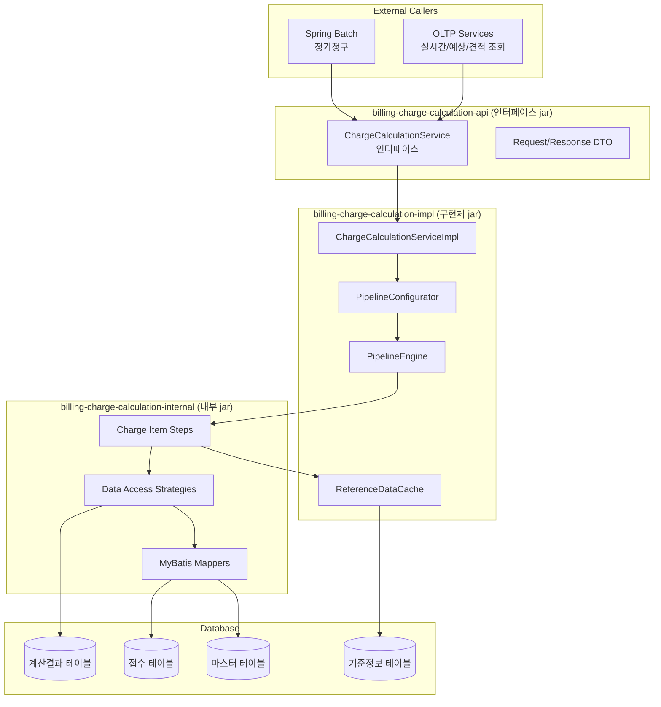
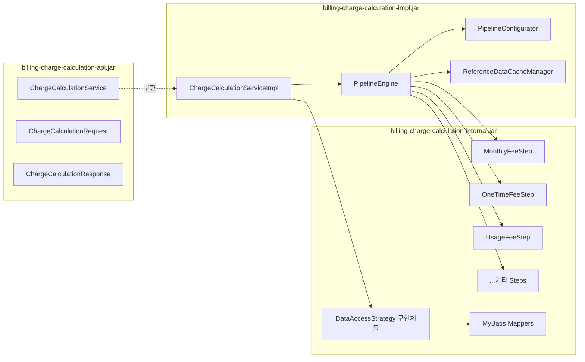
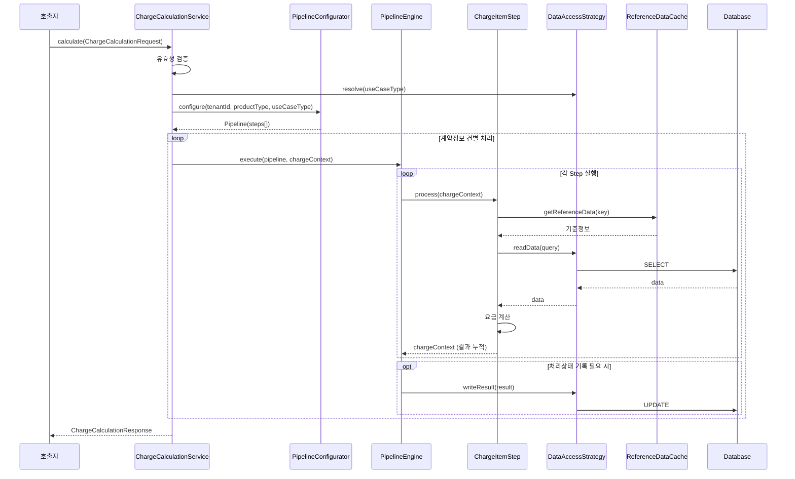
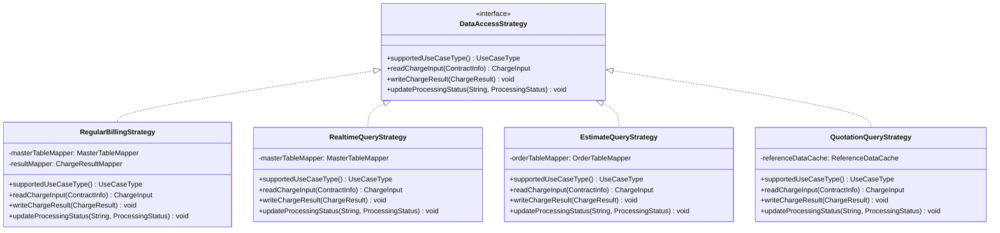
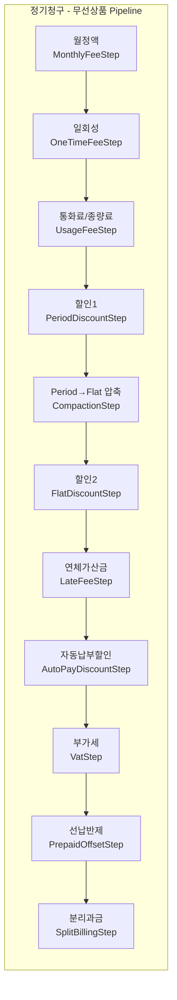
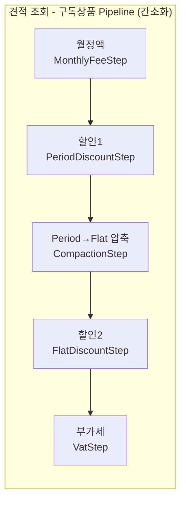
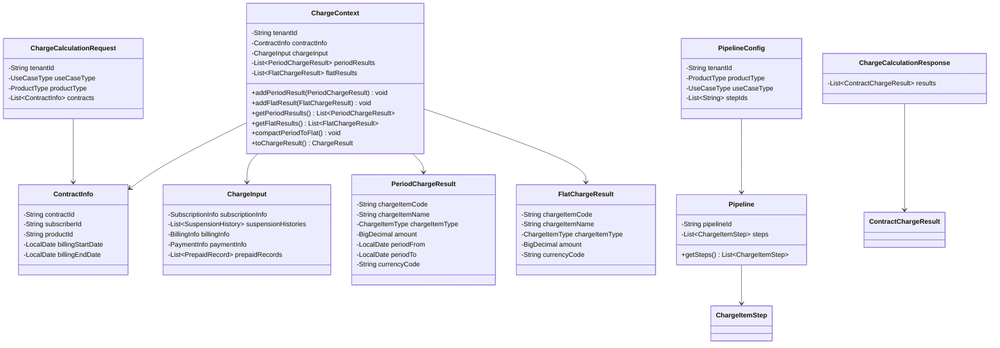
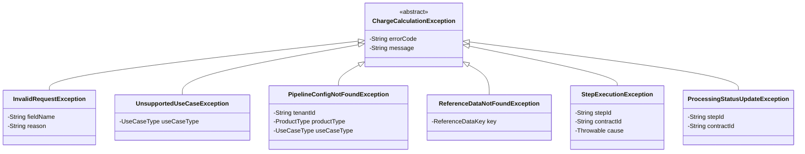

# 요금 계산 모듈 기술 설계 문서

## 개요

본 문서는 유무선 통신 billing system의 요금 계산 모듈에 대한 기술 설계를 정의한다. Legacy system을 재구축하면서, Pipeline/Step 기반의 유연한 요금 계산 프레임워크를 설계하고, Strategy Pattern을 통해 다양한 유스케이스(정기청구, 실시간 조회, 예상 조회, 견적 조회)를 단일 진입점 API로 처리한다.

### 설계 목표

- 단일 진입점 API를 통한 다양한 요금 계산 유스케이스 통합 처리
- Pipeline/Step 패턴으로 요금 계산 흐름의 선언적 구성 (if/else 제거)
- Strategy Pattern 기반 데이터 접근 추상화 (OCP 준수)
- 기준정보 인메모리 캐시를 통한 I/O 효율 극대화
- 멀티테넌시 지원
- TMForum 사양 준수
- 3-jar 컴포넌트 구조 (인터페이스/구현체/내부)

### 기술 스택

| 항목 | 기술 |
|------|------|
| 언어 | Java 25 |
| 프레임워크 | Spring Boot 4.x |
| ORM | MyBatis |
| DBMS | Oracle |
| 아키텍처 | Modular Monolithic |
| 배치 | Spring Batch |
| 캐시 | Caffeine (Spring Cache 추상화) |

## 아키텍처

### High-Level 시스템 아키텍처



### 3-Jar 컴포넌트 구조



### 요금 계산 처리 흐름 (시퀀스 다이어그램)



## 컴포넌트 및 인터페이스

### 핵심 인터페이스 설계

#### 1. ChargeCalculationService (인터페이스 jar)

타 컴포넌트에 노출되는 단일 진입점 인터페이스.

```java
/**
 * 요금 계산 단일 진입점 서비스 인터페이스.
 * billing-charge-calculation-api.jar에 위치.
 */
public interface ChargeCalculationService {

    /**
     * 요금 계산을 수행한다.
     * 정기청구 시 복수 건, OLTP 시 단건 처리.
     *
     * @param request 요금 계산 요청 (유스케이스 구분, 테넌트ID, 계약정보 리스트 포함)
     * @return 요금 계산 응답 (계약별 계산 결과 리스트)
     */
    ChargeCalculationResponse calculate(ChargeCalculationRequest request);
}
```

#### 2. DataAccessStrategy (내부 jar)

유스케이스별 데이터 접근 전략 인터페이스.

```java
/**
 * 요금 계산 유스케이스별 데이터 읽기/쓰기 전략.
 * Strategy Pattern의 핵심 인터페이스.
 */
public interface DataAccessStrategy {

    /**
     * 이 전략이 지원하는 유스케이스 유형.
     */
    UseCaseType supportedUseCaseType();

    /**
     * 계약정보 기반으로 요금 계산에 필요한 입력 데이터를 조회한다.
     */
    ChargeInput readChargeInput(ContractInfo contractInfo);

    /**
     * 요금 계산 결과를 저장한다.
     * 견적/예상 조회 등 저장이 불필요한 전략은 no-op.
     */
    void writeChargeResult(ChargeResult result);

    /**
     * 요금 항목 처리 상태를 DB에 갱신한다.
     * 저장이 불필요한 전략은 no-op.
     */
    void updateProcessingStatus(String chargeItemId, ProcessingStatus status);
}
```

#### 3. ChargeItemStep (내부 jar)

Pipeline에서 실행되는 개별 요금 항목 계산 Step 인터페이스.

```java
/**
 * Pipeline 내 개별 요금 항목 계산 Step.
 * 각 요금 항목(월정액, 일회성, 할인 등)은 이 인터페이스를 구현한다.
 */
public interface ChargeItemStep {

    /**
     * 이 Step의 고유 식별자.
     */
    String getStepId();

    /**
     * 이 Step의 실행 순서 (Pipeline 내 정렬 기준).
     */
    int getOrder();

    /**
     * 요금 계산을 수행한다.
     * ChargeContext에서 입력을 읽고, 계산 결과를 ChargeContext에 누적한다.
     *
     * @param context 요금 계산 컨텍스트 (입력 데이터 + 이전 Step 결과)
     */
    void process(ChargeContext context);

    /**
     * 이 Step 완료 후 처리 상태를 DB에 기록해야 하는지 여부.
     */
    boolean requiresStatusUpdate();
}
```

#### 4. PipelineConfigurator (구현체 jar)

```java
/**
 * 테넌트ID, 상품유형, 유스케이스에 따라 Pipeline을 구성한다.
 * Pipeline 구성 정보는 DB 또는 설정 파일에서 관리한다.
 */
public interface PipelineConfigurator {

    /**
     * 주어진 조건에 맞는 Pipeline을 구성하여 반환한다.
     *
     * @param tenantId 테넌트 ID
     * @param productType 상품 유형
     * @param useCaseType 요금 계산 유스케이스 구분
     * @return 구성된 Pipeline (Step 목록 포함)
     */
    Pipeline configure(String tenantId, ProductType productType, UseCaseType useCaseType);
}
```

#### 5. ReferenceDataCache (구현체 jar)

```java
/**
 * 기준정보 인메모리 캐시 인터페이스.
 * 요금 계산 로직은 캐시 사용 여부를 인지하지 않는다.
 */
public interface ReferenceDataCache {

    /**
     * 기준정보를 조회한다. 캐시 히트 시 메모리에서, 미스 시 DB에서 조회 후 캐싱.
     */
    <T> T getReferenceData(String tenantId, ReferenceDataKey key, Class<T> type);

    /**
     * 정기청구 배치 시작 시 필요한 기준정보를 사전 적재한다.
     */
    void preload(String tenantId, Collection<ReferenceDataKey> keys);

    /**
     * 특정 기준정보의 캐시를 무효화한다.
     */
    void invalidate(String tenantId, ReferenceDataKey key);

    /**
     * 테넌트의 전체 캐시를 무효화한다.
     */
    void invalidateAll(String tenantId);
}
```

### Strategy 구현체 클래스 다이어그램



### Step 구현체 클래스 다이어그램

```mermaid
classDiagram
    class ChargeItemStep {
        <<interface>>
        +getStepId() String
        +getOrder() int
        +process(ChargeContext) void
        +requiresStatusUpdate() boolean
    }

    class MonthlyFeeStep {
        +getStepId() String
        +getOrder() int
        +process(ChargeContext) void
        +requiresStatusUpdate() boolean
    }

    class OneTimeFeeStep {
        +getStepId() String
        +getOrder() int
        +process(ChargeContext) void
        +requiresStatusUpdate() boolean
    }

    class UsageFeeStep {
        +getStepId() String
        +getOrder() int
        +process(ChargeContext) void
        +requiresStatusUpdate() boolean
    }

    class PeriodDiscountStep {
        +getStepId() String
        +getOrder() int
        +process(ChargeContext) void
        +requiresStatusUpdate() boolean
    }

    class PeriodToFlatCompactionStep {
        +getStepId() String
        +getOrder() int
        +process(ChargeContext) void
        +requiresStatusUpdate() boolean
    }

    class FlatDiscountStep {
        +getStepId() String
        +getOrder() int
        +process(ChargeContext) void
        +requiresStatusUpdate() boolean
    }

    class LateFeeStep {
        +getStepId() String
        +getOrder() int
        +process(ChargeContext) void
        +requiresStatusUpdate() boolean
    }

    class AutoPayDiscountStep {
        +getStepId() String
        +getOrder() int
        +process(ChargeContext) void
        +requiresStatusUpdate() boolean
    }

    class VatStep {
        +getStepId() String
        +getOrder() int
        +process(ChargeContext) void
        +requiresStatusUpdate() boolean
    }

    class PrepaidOffsetStep {
        +getStepId() String
        +getOrder() int
        +process(ChargeContext) void
        +requiresStatusUpdate() boolean
    }

    class SplitBillingStep {
        +getStepId() String
        +getOrder() int
        +process(ChargeContext) void
        +requiresStatusUpdate() boolean
    }

    ChargeItemStep <|.. MonthlyFeeStep
    ChargeItemStep <|.. OneTimeFeeStep
    ChargeItemStep <|.. UsageFeeStep
    ChargeItemStep <|.. PeriodDiscountStep
    ChargeItemStep <|.. PeriodToFlatCompactionStep
    ChargeItemStep <|.. FlatDiscountStep
    ChargeItemStep <|.. LateFeeStep
    ChargeItemStep <|.. AutoPayDiscountStep
    ChargeItemStep <|.. VatStep
    ChargeItemStep <|.. PrepaidOffsetStep
    ChargeItemStep <|.. SplitBillingStep
```



### Pipeline 실행 엔진 상세 설계

#### PipelineEngine

```java
/**
 * Pipeline을 실행하는 엔진.
 * Step 목록을 순서대로 실행하고, 처리 상태 갱신을 관리한다.
 */
@Component
public class PipelineEngine {

    private final DataAccessStrategyResolver strategyResolver;

    /**
     * Pipeline을 실행한다.
     *
     * @param pipeline 실행할 Pipeline (Step 목록 포함)
     * @param context 요금 계산 컨텍스트
     * @param strategy 데이터 접근 전략
     */
    public void execute(Pipeline pipeline, ChargeContext context, DataAccessStrategy strategy) {
        for (ChargeItemStep step : pipeline.getSteps()) {
            step.process(context);

            if (step.requiresStatusUpdate()) {
                strategy.updateProcessingStatus(
                    step.getStepId(),
                    ProcessingStatus.COMPLETED
                );
            }
        }
    }
}
```

#### ChargeCalculationServiceImpl

```java
@Service
public class ChargeCalculationServiceImpl implements ChargeCalculationService {

    private final PipelineConfigurator pipelineConfigurator;
    private final PipelineEngine pipelineEngine;
    private final DataAccessStrategyResolver strategyResolver;

    @Override
    public ChargeCalculationResponse calculate(ChargeCalculationRequest request) {
        // 1. 유효성 검증
        validate(request);

        // 2. DataAccessStrategy 결정
        DataAccessStrategy strategy = strategyResolver.resolve(request.getUseCaseType());

        // 3. Pipeline 구성
        Pipeline pipeline = pipelineConfigurator.configure(
            request.getTenantId(),
            request.getProductType(),
            request.getUseCaseType()
        );

        // 4. 계약정보 건별 처리
        List<ContractChargeResult> results = new ArrayList<>();
        for (ContractInfo contract : request.getContracts()) {
            // 4-1. 입력 데이터 조회
            ChargeInput input = strategy.readChargeInput(contract);

            // 4-2. ChargeContext 생성
            ChargeContext context = ChargeContext.of(request.getTenantId(), contract, input);

            // 4-3. Pipeline 실행
            pipelineEngine.execute(pipeline, context, strategy);

            // 4-4. 결과 저장 (전략에 따라 no-op 가능)
            strategy.writeChargeResult(context.toChargeResult());

            results.add(context.toContractChargeResult());
        }

        return ChargeCalculationResponse.of(results);
    }

    private void validate(ChargeCalculationRequest request) {
        if (request.getUseCaseType() == null) {
            throw new InvalidRequestException("유스케이스 구분 값이 누락되었습니다.");
        }
        if (request.getContracts() == null || request.getContracts().isEmpty()) {
            throw new InvalidRequestException("계약정보 리스트가 비어 있습니다.");
        }
    }
}
```

### 월정액 선분이력 교차 처리 알고리즘

```java
/**
 * 선분이력 교차(intersection) 처리 유틸리티.
 * 복수의 선분이력(가입이력, 정지이력 등)을 교차하여 겹치지 않는 구간으로 분리한다.
 */
public class PeriodIntersectionUtil {

    /**
     * 여러 선분이력 리스트를 교차 처리하여 최종 구간 목록을 생성한다.
     *
     * 알고리즘:
     * 1. 모든 선분이력의 시작/종료 시점을 수집하여 정렬
     * 2. 인접한 시점 쌍으로 구간을 생성
     * 3. 각 구간에 대해 해당 시점에 유효한 이력 정보를 매핑
     *
     * @param periodHistories 선분이력 리스트들 (가입이력, 정지이력, 요금이력 등)
     * @return 교차 처리된 구간 목록
     */
    public static List<IntersectedPeriod> intersect(List<List<PeriodHistory>> periodHistories) {
        // 1. 모든 경계 시점 수집 및 정렬
        TreeSet<LocalDate> boundaries = new TreeSet<>();
        for (List<PeriodHistory> histories : periodHistories) {
            for (PeriodHistory h : histories) {
                boundaries.add(h.getStartDate());
                boundaries.add(h.getEndDate().plusDays(1));
            }
        }

        // 2. 인접 경계 시점 쌍으로 구간 생성
        List<IntersectedPeriod> result = new ArrayList<>();
        LocalDate[] dates = boundaries.toArray(new LocalDate[0]);
        for (int i = 0; i < dates.length - 1; i++) {
            LocalDate from = dates[i];
            LocalDate to = dates[i + 1].minusDays(1);

            // 3. 각 구간에 유효한 이력 매핑
            Map<String, PeriodHistory> activeHistories = new HashMap<>();
            for (List<PeriodHistory> histories : periodHistories) {
                for (PeriodHistory h : histories) {
                    if (!h.getEndDate().isBefore(from) && !h.getStartDate().isAfter(to)) {
                        activeHistories.put(h.getHistoryType(), h);
                    }
                }
            }

            if (!activeHistories.isEmpty()) {
                result.add(new IntersectedPeriod(from, to, activeHistories));
            }
        }

        return result;
    }
}
```

### 할인1 완료 후 Period → Flat 압축 알고리즘

```java
/**
 * 기간 존재 결과를 기간 미존재 결과로 압축한다.
 * 할인1 Step 완료 후 실행되는 PeriodToFlatCompactionStep에서 사용.
 */
public class PeriodToFlatCompactor {

    /**
     * Period_Charge_Result 목록을 항목별로 group by sum하여
     * Flat_Charge_Result 목록으로 변환한다.
     *
     * @param periodResults 기간 존재 요금 계산 결과 목록
     * @return 항목별 합산된 기간 미존재 결과 목록
     */
    public static List<FlatChargeResult> compact(List<PeriodChargeResult> periodResults) {
        return periodResults.stream()
            .collect(Collectors.groupingBy(
                PeriodChargeResult::getChargeItemCode,
                Collectors.reducing(BigDecimal.ZERO, PeriodChargeResult::getAmount, BigDecimal::add)
            ))
            .entrySet().stream()
            .map(entry -> FlatChargeResult.of(entry.getKey(), entry.getValue()))
            .toList();
    }
}
```

### Pipeline 구성 예시






## 데이터 모델

### 핵심 도메인 모델 클래스 다이어그램



### Enum 정의

```java
/**
 * 요금 계산 유스케이스 유형.
 */
public enum UseCaseType {
    REGULAR_BILLING,      // 정기청구
    REALTIME_QUERY,       // 실시간 요금 조회
    ESTIMATE_QUERY,       // 예상 요금 조회
    QUOTATION_QUERY       // 견적 요금 조회
}

/**
 * 상품 유형.
 */
public enum ProductType {
    WIRELESS,             // 무선
    WIRELINE,             // 유선
    NON_LINE,             // 비회선
    SUBSCRIPTION          // 구독상품
}

/**
 * 요금 항목 유형.
 */
public enum ChargeItemType {
    MONTHLY_FEE,          // 월정액
    ONE_TIME_FEE,         // 일회성
    USAGE_FEE,            // 통화료/종량료
    PERIOD_DISCOUNT,      // 할인1 (기간 존재)
    FLAT_DISCOUNT,        // 할인2 (기간 미존재)
    LATE_FEE,             // 연체가산금
    AUTO_PAY_DISCOUNT,    // 자동납부할인
    VAT,                  // 부가세
    PREPAID_OFFSET,       // 선납반제
    SPLIT_BILLING         // 분리과금
}

/**
 * 처리 상태.
 */
public enum ProcessingStatus {
    PENDING,
    IN_PROGRESS,
    COMPLETED,
    FAILED
}
```

### 요금 계산 결과 모델 상세

```java
/**
 * 기간 존재 요금 계산 결과.
 * 월정액, 할인1 등 기간 정보가 필요한 요금 항목의 결과.
 */
public record PeriodChargeResult(
    String chargeItemCode,
    String chargeItemName,
    ChargeItemType chargeItemType,
    BigDecimal amount,
    LocalDate periodFrom,
    LocalDate periodTo,
    String currencyCode,
    Map<String, Object> metadata
) {
    public static PeriodChargeResult of(String code, ChargeItemType type,
                                         BigDecimal amount, LocalDate from, LocalDate to) {
        return new PeriodChargeResult(code, null, type, amount, from, to, "KRW", Map.of());
    }
}

/**
 * 기간 미존재 요금 계산 결과.
 * 일회성, 통화료, 할인2, 부가세 등 기간 정보가 불필요한 요금 항목의 결과.
 */
public record FlatChargeResult(
    String chargeItemCode,
    String chargeItemName,
    ChargeItemType chargeItemType,
    BigDecimal amount,
    String currencyCode,
    Map<String, Object> metadata
) {
    public static FlatChargeResult of(String code, BigDecimal amount) {
        return new FlatChargeResult(code, null, null, amount, "KRW", Map.of());
    }
}
```

### ChargeContext 상세 설계

```java
/**
 * 요금 계산 과정에서 입력 데이터와 중간 계산 결과를 담는 컨텍스트.
 * Pipeline의 각 Step 간 데이터 전달 매개체.
 */
public class ChargeContext {

    private final String tenantId;
    private final ContractInfo contractInfo;
    private final ChargeInput chargeInput;
    private final List<PeriodChargeResult> periodResults = new ArrayList<>();
    private final List<FlatChargeResult> flatResults = new ArrayList<>();

    public static ChargeContext of(String tenantId, ContractInfo contractInfo, ChargeInput input) {
        return new ChargeContext(tenantId, contractInfo, input);
    }

    /** 기간 존재 결과 추가 (월정액, 할인1) */
    public void addPeriodResult(PeriodChargeResult result) {
        periodResults.add(result);
    }

    /** 기간 미존재 결과 추가 (일회성, 통화료, 할인2, 부가세 등) */
    public void addFlatResult(FlatChargeResult result) {
        flatResults.add(result);
    }

    /** 특정 유형의 기간 존재 결과만 조회 */
    public List<PeriodChargeResult> getPeriodResultsByType(ChargeItemType type) {
        return periodResults.stream()
            .filter(r -> r.chargeItemType() == type)
            .toList();
    }

    /** 특정 유형의 기간 미존재 결과만 조회 */
    public List<FlatChargeResult> getFlatResultsByType(ChargeItemType type) {
        return flatResults.stream()
            .filter(r -> r.chargeItemType() == type)
            .toList();
    }

    /**
     * 할인1 완료 후 호출.
     * 기간 존재 결과(원금 + 할인1)를 항목별 합산하여 Flat 결과로 압축한다.
     */
    public void compactPeriodToFlat() {
        List<FlatChargeResult> compacted = PeriodToFlatCompactor.compact(periodResults);
        flatResults.addAll(compacted);
        periodResults.clear();
    }

    /** 최종 요금 계산 결과 생성 */
    public ChargeResult toChargeResult() {
        return new ChargeResult(contractInfo.getContractId(), flatResults);
    }
}
```

### 기준정보 캐시 키 설계

```java
/**
 * 기준정보 캐시 키.
 * 테넌트별로 분리된 캐시 관리를 위해 tenantId를 포함한다.
 */
public record ReferenceDataKey(
    ReferenceDataType type,
    String keyValue
) {
    public enum ReferenceDataType {
        PRODUCT_FEE,          // 상품 요금
        DISCOUNT_POLICY,      // 할인 정책
        TAX_RULE,             // 과세 기준
        SPLIT_BILLING_RULE,   // 분리과금 기준
        AUTO_PAY_DISCOUNT,    // 자동납부할인 기준
        SPECIAL_PRODUCT_INFO  // 특이상품 추가 정보
    }
}
```

### 캐시 관리 상세 설계

```java
/**
 * Caffeine 기반 기준정보 캐시 구현체.
 * 테넌트별 캐시 분리, 사전 적재, 무효화를 지원한다.
 */
@Component
public class CaffeineReferenceDataCache implements ReferenceDataCache {

    /** 테넌트별 캐시 인스턴스. key = tenantId */
    private final ConcurrentHashMap<String, Cache<ReferenceDataKey, Object>> tenantCaches
        = new ConcurrentHashMap<>();

    private final ReferenceDataMapper referenceDataMapper;

    @Override
    public <T> T getReferenceData(String tenantId, ReferenceDataKey key, Class<T> type) {
        Cache<ReferenceDataKey, Object> cache = getOrCreateCache(tenantId);
        Object value = cache.get(key, k -> referenceDataMapper.selectReferenceData(tenantId, k));
        return type.cast(value);
    }

    @Override
    public void preload(String tenantId, Collection<ReferenceDataKey> keys) {
        Cache<ReferenceDataKey, Object> cache = getOrCreateCache(tenantId);
        Map<ReferenceDataKey, Object> data = referenceDataMapper.selectBulkReferenceData(tenantId, keys);
        cache.putAll(data);
    }

    @Override
    public void invalidate(String tenantId, ReferenceDataKey key) {
        Cache<ReferenceDataKey, Object> cache = tenantCaches.get(tenantId);
        if (cache != null) {
            cache.invalidate(key);
        }
    }

    @Override
    public void invalidateAll(String tenantId) {
        Cache<ReferenceDataKey, Object> cache = tenantCaches.get(tenantId);
        if (cache != null) {
            cache.invalidateAll();
        }
    }

    private Cache<ReferenceDataKey, Object> getOrCreateCache(String tenantId) {
        return tenantCaches.computeIfAbsent(tenantId, id ->
            Caffeine.newBuilder()
                .maximumSize(10_000)
                .expireAfterWrite(Duration.ofHours(1))
                .build()
        );
    }
}
```

### Pipeline 구성 데이터 모델 (DB 테이블)

```sql
-- Pipeline 구성 마스터 테이블
CREATE TABLE PIPELINE_CONFIG (
    PIPELINE_CONFIG_ID  VARCHAR2(36)  PRIMARY KEY,
    TENANT_ID           VARCHAR2(20)  NOT NULL,
    PRODUCT_TYPE        VARCHAR2(20)  NOT NULL,
    USE_CASE_TYPE       VARCHAR2(20)  NOT NULL,
    DESCRIPTION         VARCHAR2(200),
    ACTIVE_YN           CHAR(1)       DEFAULT 'Y',
    CONSTRAINT UK_PIPELINE_CONFIG UNIQUE (TENANT_ID, PRODUCT_TYPE, USE_CASE_TYPE)
);

-- Pipeline Step 구성 상세 테이블
CREATE TABLE PIPELINE_STEP_CONFIG (
    PIPELINE_CONFIG_ID  VARCHAR2(36)  NOT NULL,
    STEP_ID             VARCHAR2(50)  NOT NULL,
    STEP_ORDER          NUMBER(3)     NOT NULL,
    ACTIVE_YN           CHAR(1)       DEFAULT 'Y',
    CONSTRAINT PK_PIPELINE_STEP PRIMARY KEY (PIPELINE_CONFIG_ID, STEP_ID),
    CONSTRAINT FK_PIPELINE_STEP FOREIGN KEY (PIPELINE_CONFIG_ID)
        REFERENCES PIPELINE_CONFIG(PIPELINE_CONFIG_ID)
);

-- 요금 항목 처리 상태 테이블
CREATE TABLE CHARGE_PROCESSING_STATUS (
    PROCESSING_ID       VARCHAR2(36)  PRIMARY KEY,
    CONTRACT_ID         VARCHAR2(36)  NOT NULL,
    STEP_ID             VARCHAR2(50)  NOT NULL,
    STATUS              VARCHAR2(20)  NOT NULL,
    PROCESSED_AT        TIMESTAMP     DEFAULT SYSTIMESTAMP,
    ERROR_MESSAGE       VARCHAR2(4000),
    CONSTRAINT UK_PROCESSING UNIQUE (CONTRACT_ID, STEP_ID)
);
```


## 정합성 속성 (Correctness Properties)

*정합성 속성(Property)이란 시스템의 모든 유효한 실행에서 참이어야 하는 특성 또는 동작을 의미한다. 속성은 사람이 읽을 수 있는 명세와 기계가 검증할 수 있는 정확성 보증 사이의 다리 역할을 한다.*

### Property 1: Strategy 선택 일관성

*임의의* UseCaseType에 대해, DataAccessStrategyResolver가 반환하는 Strategy의 supportedUseCaseType()은 요청된 UseCaseType과 항상 일치해야 한다.

**Validates: Requirements 1.2**

### Property 2: 계약정보 건수와 결과 건수 일치

*임의의* 비어있지 않은 계약정보 리스트에 대해, ChargeCalculationService.calculate()의 응답에 포함된 결과 건수는 입력 계약정보 건수와 항상 일치해야 한다.

**Validates: Requirements 1.3**

### Property 3: Pipeline Step 실행 순서 보장

*임의의* Pipeline 구성에 대해, PipelineEngine이 Step을 실행하는 순서는 Pipeline에 구성된 Step의 order 순서와 항상 일치해야 한다.

**Validates: Requirements 3.3**

### Property 4: ChargeContext 결과 누적 및 참조

*임의의* Step 시퀀스에서, 이전 Step이 ChargeContext에 추가한 PeriodChargeResult 또는 FlatChargeResult는 후속 Step에서 항상 조회 가능해야 하며, 추가된 결과가 유실되거나 변조되지 않아야 한다.

**Validates: Requirements 3.4, 15.3**

### Property 5: Pipeline 구성의 테넌트/상품유형/유스케이스 결정성

*임의의* (tenantId, productType, useCaseType) 조합에 대해, PipelineConfigurator가 반환하는 Pipeline의 Step 목록은 해당 조합의 DB 설정(PIPELINE_CONFIG, PIPELINE_STEP_CONFIG)과 항상 일치해야 한다.

**Validates: Requirements 3.2, 17.2**

### Property 6: 기준정보 캐시 라운드트립

*임의의* 기준정보에 대해, ReferenceDataCache에 적재(preload 또는 최초 조회)한 후 동일 키로 조회하면 원본 데이터와 동일한 값이 반환되어야 한다.

**Validates: Requirements 4.1**

### Property 7: 캐시 무효화 후 최신 데이터 반환

*임의의* 캐시된 기준정보에 대해, invalidate() 호출 후 다시 조회하면 DB의 최신 데이터가 반환되어야 한다. (캐시 무효화 → 재조회 = DB 최신값)

**Validates: Requirements 4.3, 4.4**

### Property 8: 테넌트별 캐시 격리

*임의의* 두 테넌트 A, B에 대해, 테넌트 A의 캐시를 무효화(invalidate 또는 invalidateAll)해도 테넌트 B의 캐시 데이터는 영향을 받지 않아야 한다.

**Validates: Requirements 17.3**

### Property 9: 선분이력 교차 처리 결과 비중첩성

*임의의* 선분이력 집합에 대해, PeriodIntersectionUtil.intersect()의 결과로 생성된 구간들은 서로 겹치지 않아야 한다. 즉, 임의의 두 구간 A, B에 대해 A.to < B.from 또는 B.to < A.from이어야 한다.

**Validates: Requirements 5.3**

### Property 10: 월정액 계산 결과 기간 유효성

*임의의* 월정액 계산 입력(가입정보, 정지이력, 기준정보)에 대해, 계산 결과인 PeriodChargeResult의 periodFrom은 항상 periodTo 이하이어야 하며, 금액은 0 이상이고 해당 구간의 기준 요금을 초과하지 않아야 한다.

**Validates: Requirements 5.1, 5.2**

### Property 11: 요금 항목 결과 유형 일관성

*임의의* ChargeItemStep 실행에 대해, 월정액과 할인1 Step은 PeriodChargeResult를, 그 외 Step(일회성, 통화료/종량료, 할인2, 연체가산금, 자동납부할인, 부가세, 선납반제, 분리과금)은 FlatChargeResult를 출력해야 한다.

**Validates: Requirements 5.2, 6.2, 7.2, 8.2, 9.2, 10.2, 11.2, 12.2, 13.2, 14.2, 15.2**

### Property 12: 할인 금액 상한 불변식

*임의의* 할인 계산(할인1, 할인2)에 대해, 할인 금액의 절대값은 대상 원금성 항목의 금액을 초과하지 않아야 한다.

**Validates: Requirements 8.1, 9.1**

### Property 13: Period → Flat 압축 금액 보존

*임의의* PeriodChargeResult 목록에 대해, PeriodToFlatCompactor.compact() 수행 후 항목코드별 합산 금액은 원본 PeriodChargeResult의 항목코드별 합산 금액과 일치해야 한다.

**Validates: Requirements 8.3**

### Property 14: 분리과금 총액 보존

*임의의* 요금 계산 결과에 대해, 분리과금 처리 후 분리된 항목들의 총합은 분리과금 처리 전 총액과 일치해야 한다.

**Validates: Requirements 14.1**

### Property 15: 처리 상태 기록 조건부 실행

*임의의* Pipeline 실행에서, requiresStatusUpdate()가 true인 Step이 정상 완료되면 해당 Step의 처리 상태가 COMPLETED로 DB에 기록되어야 하고, false인 Step은 상태 기록이 발생하지 않아야 한다.

**Validates: Requirements 16.1**

### Property 16: 테넌트별 요금 계산 정책 격리

*임의의* 서로 다른 두 테넌트에 대해, 동일한 상품유형과 유스케이스로 요금 계산을 수행했을 때, 각 테넌트의 Pipeline 구성과 기준정보가 독립적으로 적용되어야 한다.

**Validates: Requirements 17.1**

## 오류 처리

### 오류 처리 전략

| 오류 유형 | 처리 방식 | 설명 |
|-----------|-----------|------|
| 유효성 검증 오류 | InvalidRequestException 발생 | 유스케이스 구분 누락, 빈 계약정보 리스트 |
| Strategy 미존재 | UnsupportedUseCaseException 발생 | 지원하지 않는 유스케이스 유형 |
| Pipeline 구성 미존재 | PipelineConfigNotFoundException 발생 | 해당 조합의 Pipeline 설정이 없음 |
| 기준정보 조회 실패 | DB fallback 후 실패 시 ReferenceDataNotFoundException | 캐시 미스 + DB 조회 실패 |
| Step 실행 오류 | StepExecutionException 발생, 해당 계약 실패 처리 | 개별 Step 내 비즈니스 로직 오류 |
| 처리 상태 DB 갱신 오류 | 오류 로깅 + 해당 계약 실패 처리 | DB 갱신 실패 시 전체 계약 실패 |
| DB 연결 오류 | DataAccessException 발생, 재시도 후 실패 처리 | 일시적 DB 연결 문제 |

### 예외 계층 구조



### 정기청구 배치 오류 처리

```java
/**
 * 정기청구 배치에서의 오류 처리 전략.
 * 개별 계약 실패 시 해당 건만 실패 처리하고 나머지는 계속 진행.
 */
public class BatchChargeCalculationProcessor {

    public List<ContractChargeResult> processChunk(List<ContractInfo> contracts,
                                                     Pipeline pipeline,
                                                     DataAccessStrategy strategy) {
        List<ContractChargeResult> results = new ArrayList<>();

        for (ContractInfo contract : contracts) {
            try {
                ChargeInput input = strategy.readChargeInput(contract);
                ChargeContext context = ChargeContext.of(tenantId, contract, input);
                pipelineEngine.execute(pipeline, context, strategy);
                strategy.writeChargeResult(context.toChargeResult());
                results.add(context.toContractChargeResult());
            } catch (StepExecutionException e) {
                log.error("요금 계산 실패: contractId={}, stepId={}", 
                    contract.getContractId(), e.getStepId(), e);
                results.add(ContractChargeResult.failed(contract.getContractId(), e));
            } catch (ProcessingStatusUpdateException e) {
                log.error("처리 상태 갱신 실패: contractId={}", contract.getContractId(), e);
                results.add(ContractChargeResult.failed(contract.getContractId(), e));
            }
        }

        return results;
    }
}
```

## 테스트 전략

### 이중 테스트 접근법

본 모듈은 단위 테스트와 속성 기반 테스트(Property-Based Testing)를 병행하여 포괄적인 검증을 수행한다.

#### 속성 기반 테스트 (Property-Based Testing)

- **라이브러리**: jqwik (Java용 PBT 라이브러리)
- **최소 반복 횟수**: 각 속성 테스트당 100회 이상
- **태그 형식**: `Feature: billing-charge-calculation, Property {번호}: {속성명}`
- **각 정합성 속성은 하나의 속성 기반 테스트로 구현**

| 속성 번호 | 속성명 | 테스트 대상 | 생성기 |
|-----------|--------|-------------|--------|
| Property 1 | Strategy 선택 일관성 | DataAccessStrategyResolver | 임의의 UseCaseType |
| Property 2 | 계약정보 건수와 결과 건수 일치 | ChargeCalculationServiceImpl | 임의의 ContractInfo 리스트 (1~100건) |
| Property 3 | Pipeline Step 실행 순서 보장 | PipelineEngine | 임의의 순서를 가진 mock Step 리스트 |
| Property 4 | ChargeContext 결과 누적 및 참조 | ChargeContext | 임의의 PeriodChargeResult/FlatChargeResult |
| Property 5 | Pipeline 구성 결정성 | PipelineConfigurator | 임의의 (tenantId, productType, useCaseType) |
| Property 6 | 기준정보 캐시 라운드트립 | ReferenceDataCache | 임의의 기준정보 데이터 |
| Property 7 | 캐시 무효화 후 최신 데이터 반환 | ReferenceDataCache | 임의의 기준정보 + 변경 데이터 |
| Property 8 | 테넌트별 캐시 격리 | ReferenceDataCache | 임의의 두 테넌트ID + 기준정보 |
| Property 9 | 선분이력 교차 비중첩성 | PeriodIntersectionUtil | 임의의 PeriodHistory 리스트 |
| Property 10 | 월정액 결과 기간 유효성 | MonthlyFeeStep | 임의의 가입정보, 정지이력, 기준정보 |
| Property 11 | 결과 유형 일관성 | 각 ChargeItemStep | 임의의 ChargeContext |
| Property 12 | 할인 금액 상한 | PeriodDiscountStep, FlatDiscountStep | 임의의 원금 + 할인 정보 |
| Property 13 | Period→Flat 압축 금액 보존 | PeriodToFlatCompactor | 임의의 PeriodChargeResult 리스트 |
| Property 14 | 분리과금 총액 보존 | SplitBillingStep | 임의의 FlatChargeResult + 분리과금 기준 |
| Property 15 | 처리 상태 기록 조건부 실행 | PipelineEngine | 임의의 Step (requiresStatusUpdate true/false) |
| Property 16 | 테넌트별 정책 격리 | ChargeCalculationServiceImpl | 임의의 두 테넌트 설정 |

#### 단위 테스트

단위 테스트는 구체적인 예시, 에지 케이스, 오류 조건에 집중한다.

| 테스트 대상 | 테스트 항목 | 관련 요구사항 |
|-------------|-------------|---------------|
| ChargeCalculationServiceImpl | 유스케이스 구분 누락 시 유효성 오류 | 1.5 |
| ChargeCalculationServiceImpl | 빈 계약정보 리스트 시 유효성 오류 | 1.6 |
| ChargeCalculationServiceImpl | 4가지 유스케이스 각각 정상 처리 | 1.1 |
| RegularBillingStrategy | 마스터 테이블 읽기 + 결과 기록 | 2.2 |
| RealtimeQueryStrategy | 마스터 테이블 읽기 + 결과 미기록 | 2.3 |
| EstimateQueryStrategy | 접수 테이블 읽기 | 2.4 |
| QuotationQueryStrategy | 기준정보만 사용 | 2.5 |
| ReferenceDataCache | preload 후 캐시 히트 확인 | 4.2 |
| ReferenceDataCache | 캐시 미스 시 DB fallback | 4.6 |
| MonthlyFeeStep | 특이상품 추가 정보 조회 | 5.4 |
| PipelineEngine | 처리 상태 DB 갱신 실패 시 오류 처리 | 16.3 |
| BatchChargeCalculationProcessor | Spring Batch chunk 단위 처리 | 1.4 |

#### 테스트 구성 예시

```java
// jqwik 속성 기반 테스트 예시
class PeriodIntersectionUtilPropertyTest {

    // Feature: billing-charge-calculation, Property 9: 선분이력 교차 비중첩성
    @Property(tries = 100)
    void intersectedPeriodsShouldNotOverlap(
            @ForAll("periodHistoryLists") List<List<PeriodHistory>> histories) {
        
        List<IntersectedPeriod> result = PeriodIntersectionUtil.intersect(histories);
        
        for (int i = 0; i < result.size() - 1; i++) {
            IntersectedPeriod current = result.get(i);
            IntersectedPeriod next = result.get(i + 1);
            assertThat(current.getTo()).isBefore(next.getFrom());
        }
    }

    @Provide
    Arbitrary<List<List<PeriodHistory>>> periodHistoryLists() {
        Arbitrary<PeriodHistory> periodHistory = Combinators.combine(
            Arbitraries.localDates(),
            Arbitraries.integers().between(1, 30)
        ).as((start, days) -> new PeriodHistory(start, start.plusDays(days), "TYPE"));

        return periodHistory.list().ofMinSize(1).ofMaxSize(5)
            .list().ofMinSize(1).ofMaxSize(3);
    }
}
```

```java
// jqwik 속성 기반 테스트 예시 - Period→Flat 압축
class PeriodToFlatCompactorPropertyTest {

    // Feature: billing-charge-calculation, Property 13: Period→Flat 압축 금액 보존
    @Property(tries = 100)
    void compactionShouldPreserveTotalAmountPerItem(
            @ForAll("periodChargeResults") List<PeriodChargeResult> periodResults) {
        
        // 원본 항목코드별 합산
        Map<String, BigDecimal> originalSums = periodResults.stream()
            .collect(Collectors.groupingBy(
                PeriodChargeResult::chargeItemCode,
                Collectors.reducing(BigDecimal.ZERO, PeriodChargeResult::amount, BigDecimal::add)
            ));

        // 압축 수행
        List<FlatChargeResult> compacted = PeriodToFlatCompactor.compact(periodResults);

        // 압축 후 항목코드별 합산
        Map<String, BigDecimal> compactedSums = compacted.stream()
            .collect(Collectors.toMap(
                FlatChargeResult::chargeItemCode,
                FlatChargeResult::amount
            ));

        // 금액 보존 검증
        assertThat(compactedSums).isEqualTo(originalSums);
    }

    @Provide
    Arbitrary<List<PeriodChargeResult>> periodChargeResults() {
        Arbitrary<String> itemCodes = Arbitraries.of("MONTHLY_001", "MONTHLY_002", "DISCOUNT_001");
        Arbitrary<BigDecimal> amounts = Arbitraries.bigDecimals()
            .between(BigDecimal.ZERO, new BigDecimal("100000"));
        Arbitrary<LocalDate> dates = Arbitraries.localDates();

        return Combinators.combine(itemCodes, amounts, dates, 
            Arbitraries.integers().between(1, 30))
            .as((code, amount, start, days) -> 
                PeriodChargeResult.of(code, ChargeItemType.MONTHLY_FEE, amount, start, start.plusDays(days)))
            .list().ofMinSize(1).ofMaxSize(20);
    }
}
```

