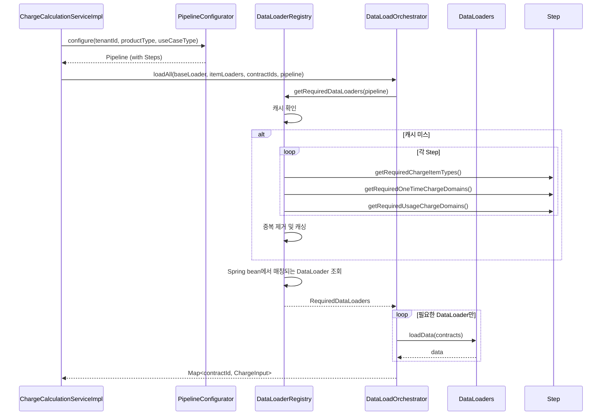
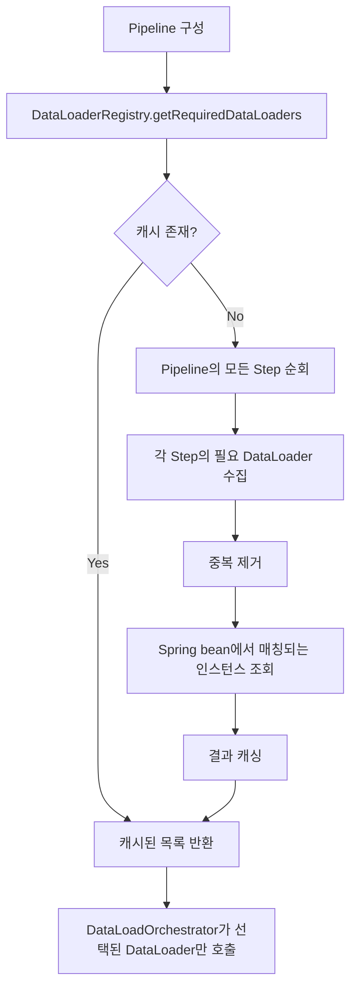
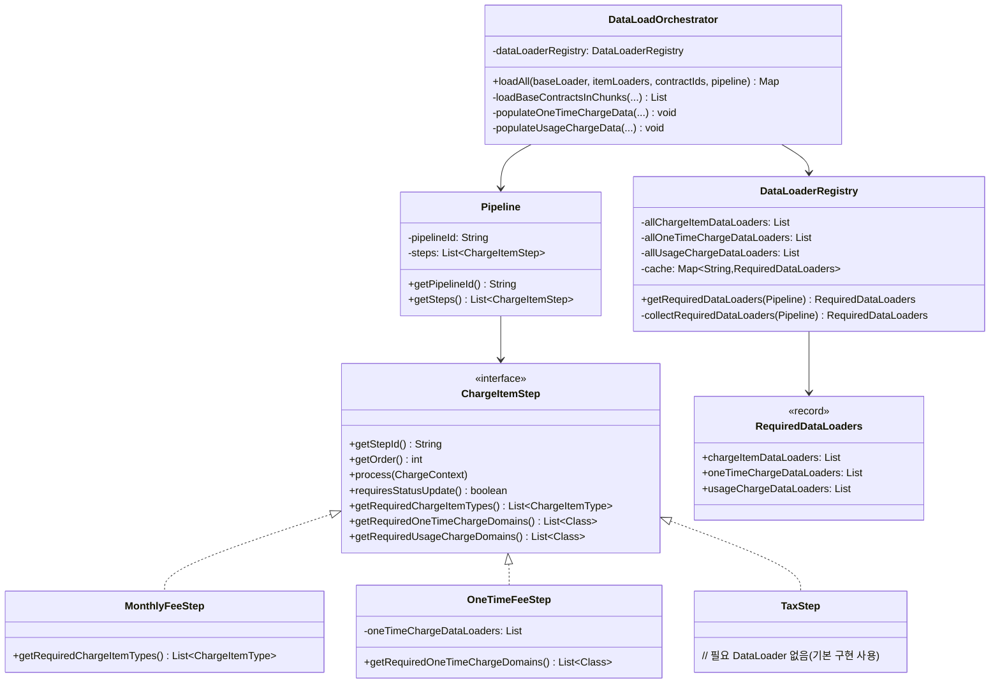

# 설계 문서: Pipeline 기반 DataLoader 선택

## 개요

본 설계 문서는 유무선 통신 billing system의 요금 계산 모듈에서 DataLoader 선택 로직을 개선하기 위한 상세 설계를 기술한다.

### 현재 문제점
현재 시스템은 DataLoadOrchestrator가 Spring 컨텍스트에 등록된 모든 OneTimeChargeDataLoader와 UsageChargeDataLoader bean을 자동 주입받아 무조건 호출한다. 이로 인해:
- Pipeline에 포함되지 않은 Step의 데이터까지 불필요하게 조회
- 불필요한 DB round trip 발생으로 성능 저하
- 리소스 낭비 (메모리, DB 커넥션)
- 정기청구 배치 처리 시 특히 성능 영향 큼

예를 들어, 견적 조회 Pipeline에는 OneTimeFeeStep이 포함되지 않는데도 모든 일회성 요금 DataLoader가 호출되어 불필요한 DB 조회가 발생한다.

### 개선 방향
- 각 Step이 자신이 필요로 하는 DataLoader를 명시적으로 선언
- Pipeline 구성 시 포함된 Step들의 필요 DataLoader를 수집
- DataLoadOrchestrator가 수집된 DataLoader만 선택적으로 호출
- 동일 Pipeline에 대한 DataLoader 목록을 캐싱하여 반복 계산 제거

### 설계 결정 근거
1. **Step의 명시적 선언**: 각 Step이 필요한 DataLoader를 인터페이스 메서드로 선언하여 의존성을 명확히 한다.
2. **DataLoaderRegistry 도입**: Pipeline과 Spring bean 사이의 중재자 역할을 수행하여 필요한 DataLoader만 필터링한다.
3. **캐싱 전략**: 동일 Pipeline에 대한 DataLoader 목록을 캐싱하여 정기청구 배치 처리 성능을 향상시킨다.
4. **하위 호환성**: 기본 구현으로 빈 리스트를 반환하여 기존 Step이 변경 없이 동작하도록 한다.

## 아키텍처

### 모듈 배치

```
billing-charge-calculation-internal (내부 전용)
├── step/
│   └── ChargeItemStep (인터페이스 확장: 필요 DataLoader 선언 메서드 추가)
├── dataloader/
│   └── DataLoaderRegistry (신규: Pipeline 기반 DataLoader 수집 및 조회)
└── (기존 구조 유지)

billing-charge-calculation-impl (구현체)
├── dataloader/
│   └── DataLoadOrchestrator (수정: DataLoaderRegistry 활용)
└── service/
    └── ChargeCalculationServiceImpl (수정: Pipeline 전달)
```


### 전체 흐름 다이어그램



### Pipeline 기반 DataLoader 선택 흐름



## 컴포넌트 및 인터페이스

### 1. ChargeItemStep 인터페이스 확장

기존 ChargeItemStep 인터페이스에 필요 DataLoader 선언 메서드를 추가한다.

```java
/**
 * 요금 항목 계산 Step 인터페이스.
 * Pipeline 내에서 개별 요금 항목 계산을 수행한다.
 */
public interface ChargeItemStep {
    
    // === 기존 메서드 (유지) ===
    String getStepId();
    int getOrder();
    void process(ChargeContext context);
    boolean requiresStatusUpdate();
    
    // === 신규 메서드: 필요 DataLoader 선언 ===
    
    /**
     * 이 Step이 필요로 하는 ChargeItemDataLoader 유형 목록을 반환한다.
     * 기본 구현은 빈 리스트를 반환한다.
     *
     * @return ChargeItemType 목록
     */
    default List<ChargeItemType> getRequiredChargeItemTypes() {
        return List.of();
    }
    
    /**
     * 이 Step이 필요로 하는 OneTimeChargeDomain 유형 목록을 반환한다.
     * 기본 구현은 빈 리스트를 반환한다.
     *
     * @return OneTimeChargeDomain Class 목록
     */
    default List<Class<? extends OneTimeChargeDomain>> getRequiredOneTimeChargeDomains() {
        return List.of();
    }
    
    /**
     * 이 Step이 필요로 하는 UsageChargeDomain 유형 목록을 반환한다.
     * 기본 구현은 빈 리스트를 반환한다.
     *
     * @return UsageChargeDomain Class 목록
     */
    default List<Class<? extends UsageChargeDomain>> getRequiredUsageChargeDomains() {
        return List.of();
    }
}
```


### 2. DataLoaderRegistry (신규)

Pipeline에서 필요한 DataLoader를 수집하고 Spring bean에서 매칭되는 인스턴스를 조회하는 레지스트리.

```java
/**
 * Pipeline 기반 DataLoader 레지스트리.
 * <p>
 * Pipeline에 포함된 Step들이 필요로 하는 DataLoader를 수집하고,
 * Spring 컨텍스트에서 해당 DataLoader bean 인스턴스를 조회한다.
 * 동일 Pipeline에 대한 결과를 캐싱하여 성능을 최적화한다.
 * </p>
 */
@Component
@RequiredArgsConstructor
@Slf4j
public class DataLoaderRegistry {

    private static final int MAX_CACHE_SIZE = 100;

    // Spring 컨텍스트에서 주입받는 전체 DataLoader bean
    private final List<ChargeItemDataLoader> allChargeItemDataLoaders;
    private final List<OneTimeChargeDataLoader<?>> allOneTimeChargeDataLoaders;
    private final List<UsageChargeDataLoader<?>> allUsageChargeDataLoaders;

    // Pipeline ID → RequiredDataLoaders 캐시 (LRU)
    private final Map<String, RequiredDataLoaders> cache = 
        Collections.synchronizedMap(new LinkedHashMap<>(MAX_CACHE_SIZE, 0.75f, true) {
            @Override
            protected boolean removeEldestEntry(Map.Entry<String, RequiredDataLoaders> eldest) {
                return size() > MAX_CACHE_SIZE;
            }
        });

    /**
     * Pipeline에 필요한 DataLoader 목록을 반환한다.
     * 캐시가 있으면 캐시를 반환하고, 없으면 수집 후 캐싱한다.
     *
     * @param pipeline Pipeline 객체
     * @return 필요한 DataLoader 목록
     */
    public RequiredDataLoaders getRequiredDataLoaders(Pipeline pipeline) {
        String pipelineId = pipeline.getPipelineId();
        
        RequiredDataLoaders cached = cache.get(pipelineId);
        if (cached != null) {
            log.debug("DataLoader 목록 캐시 히트: pipelineId={}", pipelineId);
            return cached;
        }

        log.debug("DataLoader 목록 수집 시작: pipelineId={}", pipelineId);
        RequiredDataLoaders required = collectRequiredDataLoaders(pipeline);
        cache.put(pipelineId, required);
        
        log.debug("DataLoader 목록 수집 완료: pipelineId={}, chargeItemTypes={}, oneTimeTypes={}, usageTypes={}",
                pipelineId, 
                required.chargeItemDataLoaders().size(),
                required.oneTimeChargeDataLoaders().size(),
                required.usageChargeDataLoaders().size());
        
        return required;
    }

    private RequiredDataLoaders collectRequiredDataLoaders(Pipeline pipeline) {
        // 1. Pipeline의 모든 Step에서 필요 DataLoader 유형 수집
        Set<ChargeItemType> requiredChargeItemTypes = new HashSet<>();
        Set<Class<? extends OneTimeChargeDomain>> requiredOneTimeTypes = new HashSet<>();
        Set<Class<? extends UsageChargeDomain>> requiredUsageTypes = new HashSet<>();

        for (ChargeItemStep step : pipeline.getSteps()) {
            requiredChargeItemTypes.addAll(step.getRequiredChargeItemTypes());
            requiredOneTimeTypes.addAll(step.getRequiredOneTimeChargeDomains());
            requiredUsageTypes.addAll(step.getRequiredUsageChargeDomains());
        }

        // 2. Spring bean에서 매칭되는 DataLoader 인스턴스 조회
        List<ChargeItemDataLoader> chargeItemLoaders = allChargeItemDataLoaders.stream()
                .filter(loader -> requiredChargeItemTypes.contains(loader.getChargeItemType()))
                .toList();

        List<OneTimeChargeDataLoader<?>> oneTimeLoaders = allOneTimeChargeDataLoaders.stream()
                .filter(loader -> requiredOneTimeTypes.contains(loader.getDomainType()))
                .toList();

        List<UsageChargeDataLoader<?>> usageLoaders = allUsageChargeDataLoaders.stream()
                .filter(loader -> requiredUsageTypes.contains(loader.getDomainType()))
                .toList();

        return new RequiredDataLoaders(chargeItemLoaders, oneTimeLoaders, usageLoaders);
    }

    /**
     * 필요한 DataLoader 목록을 담는 레코드.
     */
    public record RequiredDataLoaders(
            List<ChargeItemDataLoader> chargeItemDataLoaders,
            List<OneTimeChargeDataLoader<?>> oneTimeChargeDataLoaders,
            List<UsageChargeDataLoader<?>> usageChargeDataLoaders
    ) {}
}
```


### 3. DataLoadOrchestrator 수정

DataLoaderRegistry를 활용하여 Pipeline에 필요한 DataLoader만 호출하도록 수정한다.

```java
/**
 * 요금항목별 분리 조회를 오케스트레이션하는 핵심 컴포넌트.
 * <p>
 * 파이프라인 실행 전 필요한 데이터만 선택적으로 로딩한다.
 * DataLoaderRegistry를 통해 Pipeline에 포함된 Step이 필요로 하는 DataLoader만 호출한다.
 * </p>
 */
@Slf4j
@Component
@RequiredArgsConstructor
public class DataLoadOrchestrator {

    private static final int MAX_CHUNK_SIZE = 1000;

    private final DataLoaderRegistry dataLoaderRegistry;

    /**
     * chunk 단위로 Pipeline에 필요한 요금항목 데이터만 로딩하여 계약별 ChargeInput을 조립한다.
     *
     * @param baseLoader   계약 기본정보 로더 (유스케이스별 전략에서 제공)
     * @param itemLoaders  요금항목별 데이터 로더 목록 (유스케이스별 전략에서 제공)
     * @param contractIds  계약ID 리스트
     * @param pipeline     Pipeline 객체 (필요 DataLoader 식별용)
     * @return 계약ID → ChargeInput 매핑
     */
    public Map<String, ChargeInput> loadAll(
            ContractBaseLoader baseLoader,
            List<ChargeItemDataLoader> itemLoaders,
            List<String> contractIds,
            Pipeline pipeline) {

        if (contractIds == null || contractIds.isEmpty()) {
            return Collections.emptyMap();
        }

        // 1. 1000건 초과 시 chunk 분할하여 ContractBaseLoader로 기본정보 조회
        List<ContractInfo> baseContracts = loadBaseContractsInChunks(baseLoader, contractIds);
        if (baseContracts.isEmpty()) {
            log.debug("ContractBaseLoader 조회 결과가 비어있어 후속 로더 호출을 생략합니다.");
            return Collections.emptyMap();
        }

        // 2. ChargeInput 초기화 (계약ID → ChargeInput)
        Map<String, ChargeInput> chargeInputMap = new LinkedHashMap<>();
        for (ContractInfo contract : baseContracts) {
            chargeInputMap.put(contract.contractId(), ChargeInput.builder().build());
        }

        // 3. Pipeline에 필요한 DataLoader 목록 획득
        DataLoaderRegistry.RequiredDataLoaders required = 
            dataLoaderRegistry.getRequiredDataLoaders(pipeline);

        // 4. ChargeItemDataLoader 순차 호출 (itemLoaders는 Strategy에서 제공, 그대로 사용)
        for (ChargeItemDataLoader loader : itemLoaders) {
            log.debug("ChargeItemDataLoader 호출: {}", loader.getChargeItemType());
            loader.loadAndPopulate(baseContracts, chargeInputMap);
        }

        // 5. OneTimeChargeDataLoader 선택적 호출
        for (OneTimeChargeDataLoader<?> loader : required.oneTimeChargeDataLoaders()) {
            log.debug("OneTimeChargeDataLoader 호출: {}", loader.getDomainType().getSimpleName());
            populateOneTimeChargeData(loader, baseContracts, chargeInputMap);
        }

        // 6. UsageChargeDataLoader 선택적 호출
        for (UsageChargeDataLoader<?> loader : required.usageChargeDataLoaders()) {
            log.debug("UsageChargeDataLoader 호출: {}", loader.getDomainType().getSimpleName());
            populateUsageChargeData(loader, baseContracts, chargeInputMap);
        }

        // 7. 호출되지 않은 DataLoader 로깅
        logSkippedDataLoaders(required);

        return chargeInputMap;
    }

    private List<ContractInfo> loadBaseContractsInChunks(
            ContractBaseLoader baseLoader, List<String> contractIds) {
        if (contractIds.size() <= MAX_CHUNK_SIZE) {
            return baseLoader.loadBaseContracts(contractIds);
        }

        List<List<String>> chunks = ChunkPartitioner.partition(contractIds, MAX_CHUNK_SIZE);
        List<ContractInfo> allContracts = new ArrayList<>();
        for (List<String> chunk : chunks) {
            allContracts.addAll(baseLoader.loadBaseContracts(chunk));
        }
        return allContracts;
    }

    private <T extends OneTimeChargeDomain> void populateOneTimeChargeData(
            OneTimeChargeDataLoader<T> loader,
            List<ContractInfo> contracts,
            Map<String, ChargeInput> chargeInputMap) {
        Map<String, List<T>> dataByContract = loader.loadData(contracts);
        dataByContract.forEach((contractId, dataList) -> {
            ChargeInput input = chargeInputMap.get(contractId);
            if (input != null) {
                input.putOneTimeChargeData(loader.getDomainType(), dataList);
            }
        });
    }

    private <T extends UsageChargeDomain> void populateUsageChargeData(
            UsageChargeDataLoader<T> loader,
            List<ContractInfo> contracts,
            Map<String, ChargeInput> chargeInputMap) {
        Map<String, List<T>> dataByContract = loader.loadData(contracts);
        dataByContract.forEach((contractId, dataList) -> {
            ChargeInput input = chargeInputMap.get(contractId);
            if (input != null) {
                input.putUsageChargeData(loader.getDomainType(), dataList);
            }
        });
    }

    private void logSkippedDataLoaders(DataLoaderRegistry.RequiredDataLoaders required) {
        // 실제 호출된 DataLoader 수 로깅
        log.debug("호출된 DataLoader 수 - OneTime: {}, Usage: {}",
                required.oneTimeChargeDataLoaders().size(),
                required.usageChargeDataLoaders().size());
    }
}
```


### 4. ChargeCalculationServiceImpl 수정

Pipeline 객체를 DataLoadOrchestrator에 전달하도록 수정한다.

```java
@Slf4j
@Service
@RequiredArgsConstructor
public class ChargeCalculationServiceImpl implements ChargeCalculationService {

    private final PipelineConfigurator pipelineConfigurator;
    private final PipelineEngine pipelineEngine;
    private final DataAccessStrategyResolver strategyResolver;
    private final DataLoadOrchestrator dataLoadOrchestrator;

    @Override
    public ChargeCalculationResponse calculate(ChargeCalculationRequest request) {
        // 1. 유효성 검증
        validate(request);

        // 2. DataAccessStrategy 결정
        DataAccessStrategy strategy = strategyResolver.resolve(request.getUseCaseType());

        // 3. Pipeline 구성
        Pipeline pipeline = pipelineConfigurator.configure(
                request.getTenantId(),
                request.getProductType(),
                request.getUseCaseType());

        // 4. Strategy에서 로더 획득 후 DataLoadOrchestrator를 통한 일괄 데이터 로딩
        // Pipeline 객체를 전달하여 필요한 DataLoader만 호출
        List<String> contractIds = request.getContracts().stream()
                .map(ContractInfo::contractId)
                .toList();

        Map<String, ChargeInput> chargeInputMap = dataLoadOrchestrator.loadAll(
                strategy.getContractBaseLoader(),
                strategy.getChargeItemDataLoaders(),
                contractIds,
                pipeline);  // Pipeline 전달

        // 5. 계약정보 건별 처리
        List<ContractChargeResult> results = new ArrayList<>();
        for (ContractInfo contract : request.getContracts()) {
            ChargeInput input = chargeInputMap.getOrDefault(
                    contract.contractId(), ChargeInput.builder().build());

            ChargeContext context = ChargeContext.of(request.getTenantId(), contract, input);
            pipelineEngine.execute(pipeline, context, strategy);
            strategy.writeChargeResult(context.toChargeResult());
            results.add(context.toContractChargeResult());
        }

        return ChargeCalculationResponse.of(results);
    }

    private void validate(ChargeCalculationRequest request) {
        if (request.getUseCaseType() == null) {
            throw new InvalidRequestException("useCaseType", "유스케이스 구분 값이 누락되었습니다.");
        }
        if (request.getContracts() == null || request.getContracts().isEmpty()) {
            throw new InvalidRequestException("contracts", "계약정보 리스트가 비어 있습니다.");
        }
    }
}
```

### 5. Step 구현체 예시

각 Step이 필요한 DataLoader를 선언하는 예시.

#### MonthlyFeeStep

```java
@Slf4j
@Component
@RequiredArgsConstructor
public class MonthlyFeeStep implements ChargeItemStep {

    private static final String STEP_ID = "MONTHLY_FEE";
    private static final int ORDER = 100;

    @Override
    public String getStepId() {
        return STEP_ID;
    }

    @Override
    public int getOrder() {
        return ORDER;
    }

    @Override
    public List<ChargeItemType> getRequiredChargeItemTypes() {
        return List.of(ChargeItemType.MONTHLY_FEE);
    }

    @Override
    public void process(ChargeContext context) {
        // 월정액 계산 로직
    }

    @Override
    public boolean requiresStatusUpdate() {
        return true;
    }
}
```

#### OneTimeFeeStep (동적 선언)

```java
@Slf4j
@Component
@RequiredArgsConstructor
public class OneTimeFeeStep implements ChargeItemStep {

    private static final String STEP_ID = "ONE_TIME_FEE";
    private static final int ORDER = 200;

    // Spring 컨텍스트에서 모든 OneTimeChargeDataLoader 주입
    private final List<OneTimeChargeDataLoader<?>> oneTimeChargeDataLoaders;

    @Override
    public String getStepId() {
        return STEP_ID;
    }

    @Override
    public int getOrder() {
        return ORDER;
    }

    @Override
    public List<Class<? extends OneTimeChargeDomain>> getRequiredOneTimeChargeDomains() {
        // 주입받은 모든 OneTimeChargeDataLoader의 도메인 유형을 반환
        return oneTimeChargeDataLoaders.stream()
                .map(OneTimeChargeDataLoader::getDomainType)
                .toList();
    }

    @Override
    public void process(ChargeContext context) {
        Map<Class<? extends OneTimeChargeDomain>, List<? extends OneTimeChargeDomain>> dataMap =
            context.getChargeInput().getOneTimeChargeDataMap();

        if (dataMap == null || dataMap.isEmpty()) {
            return;
        }

        // 등록된 각 일회성 요금 유형별로 계산 로직 호출
        for (var entry : dataMap.entrySet()) {
            // 계산 로직 수행
        }
    }

    @Override
    public boolean requiresStatusUpdate() {
        return true;
    }
}
```

#### FlatDiscountStep

```java
@Slf4j
@Component
@RequiredArgsConstructor
public class FlatDiscountStep implements ChargeItemStep {

    private static final String STEP_ID = "FLAT_DISCOUNT";
    private static final int ORDER = 600;

    @Override
    public String getStepId() {
        return STEP_ID;
    }

    @Override
    public int getOrder() {
        return ORDER;
    }

    @Override
    public List<ChargeItemType> getRequiredChargeItemTypes() {
        return List.of(ChargeItemType.DISCOUNT);
    }

    @Override
    public void process(ChargeContext context) {
        // 할인 계산 로직
    }

    @Override
    public boolean requiresStatusUpdate() {
        return false;
    }
}
```

#### TaxStep (DataLoader 불필요)

```java
@Slf4j
@Component
public class TaxStep implements ChargeItemStep {

    private static final String STEP_ID = "TAX";
    private static final int ORDER = 800;

    @Override
    public String getStepId() {
        return STEP_ID;
    }

    @Override
    public int getOrder() {
        return ORDER;
    }

    // 필요 DataLoader 없음 - 기본 구현(빈 리스트) 사용

    @Override
    public void process(ChargeContext context) {
        // 기존 계산 결과만 사용하여 부가세 계산
    }

    @Override
    public boolean requiresStatusUpdate() {
        return false;
    }
}
```


## 클래스 다이어그램



## 정합성 속성 (Correctness Properties)

*속성(property)이란 시스템의 모든 유효한 실행에서 참이어야 하는 특성 또는 동작이다. 속성은 사람이 읽을 수 있는 명세와 기계가 검증할 수 있는 정합성 보장 사이의 다리 역할을 한다.*

### Property 1: Pipeline의 모든 Step 필요 DataLoader 수집

*임의의* Pipeline에 대해, DataLoaderRegistry가 수집한 필요 DataLoader 유형은:
- Pipeline에 포함된 모든 Step이 선언한 DataLoader 유형을 포함한다
- 중복된 유형은 한 번만 포함된다
- Pipeline에 포함되지 않은 Step의 DataLoader 유형은 포함되지 않는다

**Validates: Requirements 2.1, 2.2, 2.3, 2.4, 2.5**

### Property 2: DataLoader 인스턴스 매칭 정합성

*임의의* ChargeItemType/OneTimeChargeDomain/UsageChargeDomain 유형 목록에 대해, DataLoaderRegistry가 반환한 DataLoader 인스턴스는:
- 요청된 유형에 매칭되는 bean만 포함한다
- 요청되지 않은 유형의 bean은 포함되지 않는다
- 매칭되는 bean이 없는 유형은 무시된다

**Validates: Requirements 3.4, 3.5, 3.6, 3.7**

### Property 3: DataLoadOrchestrator 선택적 호출

*임의의* Pipeline에 대해, DataLoadOrchestrator가 호출한 OneTimeChargeDataLoader와 UsageChargeDataLoader는:
- DataLoaderRegistry가 반환한 목록에 포함된 DataLoader만 호출된다
- 목록에 포함되지 않은 DataLoader는 호출되지 않는다
- 모든 목록의 DataLoader가 정확히 한 번씩 호출된다

**Validates: Requirements 4.3, 4.4, 4.5, 4.6**

### Property 4: 캐시 일관성

*임의의* Pipeline ID에 대해, DataLoaderRegistry의 캐시는:
- 동일한 Pipeline ID로 반복 요청 시 동일한 RequiredDataLoaders를 반환한다
- 캐시 히트 시 Step 순회를 수행하지 않는다
- 캐시 크기가 MAX_CACHE_SIZE를 초과하지 않는다

**Validates: Requirements 5.4, 8.1, 8.2, 8.3, 8.4**

### Property 5: 하위 호환성 보장

*임의의* Step이 필요 DataLoader를 선언하지 않으면 (기본 구현 사용):
- DataLoaderRegistry는 해당 Step을 무시하고 다른 Step의 선언만 수집한다
- Pipeline 실행 시 예외가 발생하지 않는다
- 해당 Step의 process 메서드는 정상 호출된다

**Validates: Requirements 7.1, 7.2**

## 오류 처리

### 1. DataLoader 매칭 오류

| 오류 상황 | 처리 방식 |
|-----------|-----------|
| 요청된 유형에 매칭되는 DataLoader bean이 없음 | 해당 유형을 무시하고 나머지 유형만 처리 (정상 흐름) |
| Step이 필요 DataLoader를 선언하지 않음 | 빈 리스트로 처리 (정상 흐름) |
| Pipeline에 Step이 없음 | 빈 RequiredDataLoaders 반환 (정상 흐름) |

### 2. 캐시 관련 오류

| 오류 상황 | 처리 방식 |
|-----------|-----------|
| 캐시 크기 초과 | LRU 정책으로 가장 오래된 항목 제거 (정상 흐름) |
| 동시성 이슈 | Collections.synchronizedMap 사용하여 thread-safe 보장 |

### 3. 기존 예외 체계 활용

- `InvalidRequestException`: 요청 유효성 검증 실패 (기존 유지)
- `DataLoadException`: 데이터 로딩 단계 오류 (기존 유지)
- 신규 예외 불필요 - 모든 오류 상황은 정상 흐름으로 처리

## 테스트 전략

### 이중 테스트 접근법

본 설계는 단위 테스트와 속성 기반 테스트(Property-Based Testing)를 병행하여 포괄적인 검증을 수행한다.

### 단위 테스트 (JUnit 5)

단위 테스트는 구체적인 예시, 엣지 케이스, 통합 시나리오에 집중한다.

- **DataLoaderRegistry 캐시 동작**: 동일 Pipeline ID 반복 요청 시 캐시 히트 확인 (요구사항 8.2)
- **Step별 DataLoader 선언**: 각 Step 구현체가 올바른 DataLoader 유형을 선언하는지 확인 (요구사항 6.1~6.10)
- **하위 호환성**: DataLoader 선언 없는 Step이 정상 동작하는지 확인 (요구사항 7.1, 7.2)
- **통합 시나리오**: ChargeCalculationServiceImpl → DataLoadOrchestrator → DataLoaderRegistry 전체 흐름 확인
- **로깅 검증**: 호출된/호출되지 않은 DataLoader가 올바르게 로깅되는지 확인 (요구사항 9.1~9.4)

### 속성 기반 테스트 (jqwik)

속성 기반 테스트는 설계 문서의 정합성 속성을 검증한다. 각 테스트는 최소 100회 반복 실행한다.

- 각 속성 테스트는 설계 문서의 Property 번호를 참조하는 태그를 포함한다
- 태그 형식: `Feature: pipeline-based-dataloader-selection, Property {번호}: {속성명}`
- 각 정합성 속성은 하나의 속성 기반 테스트로 구현한다

| Property | 테스트 대상 | 생성기 |
|----------|------------|--------|
| Property 1 | DataLoaderRegistry.collectRequiredDataLoaders | 임의의 Step 목록을 가진 Pipeline |
| Property 2 | DataLoaderRegistry 인스턴스 매칭 | 임의의 ChargeItemType/Domain Class 목록 |
| Property 3 | DataLoadOrchestrator 호출 추적 | 임의의 Pipeline과 mock DataLoader |
| Property 4 | DataLoaderRegistry 캐시 | 임의의 Pipeline ID 시퀀스 |
| Property 5 | 하위 호환성 | DataLoader 선언 없는 Step을 포함한 Pipeline |

### 속성 기반 테스트 라이브러리

- **jqwik 1.9.2** (이미 프로젝트에 의존성 추가됨)
- JUnit Platform 위에서 동작하며 기존 테스트 인프라와 호환
- `@Property` 어노테이션으로 속성 테스트 정의
- `@ForAll` 어노테이션으로 임의 입력 생성
- 최소 100회 반복: `@Property(tries = 100)`

## 성능 영향 분석

### 개선 전 (현재)

```
정기청구 배치 (10,000건 처리 시):
- 모든 OneTimeChargeDataLoader 호출: 5개 × 10,000건 = 50,000 row 조회
- 모든 UsageChargeDataLoader 호출: 3개 × 10,000건 = 30,000 row 조회
- 총 80,000 row 조회 (Pipeline에 포함되지 않은 Step 데이터 포함)
```

### 개선 후

```
정기청구 배치 (10,000건 처리 시, OneTimeFeeStep 미포함 Pipeline):
- 필요한 OneTimeChargeDataLoader만 호출: 0개
- 필요한 UsageChargeDataLoader만 호출: 2개 × 10,000건 = 20,000 row 조회
- 총 20,000 row 조회 (75% 감소)

캐싱 효과:
- 첫 번째 chunk: DataLoader 목록 수집 (Step 순회)
- 이후 chunk: 캐시 히트 (Step 순회 생략)
- 1,000건 chunk × 10회 = 9회 캐시 히트
```

### 예상 성능 향상

- **DB 조회량**: 최대 75% 감소 (Pipeline 구성에 따라 다름)
- **메모리 사용량**: 불필요한 데이터 미적재로 감소
- **처리 시간**: 정기청구 배치 기준 약 30~40% 단축 예상
- **DB 커넥션 사용**: 불필요한 조회 제거로 커넥션 풀 효율 향상

## 마이그레이션 전략

### 단계적 적용

1. **Phase 1**: DataLoaderRegistry 및 인터페이스 확장 구현
2. **Phase 2**: DataLoadOrchestrator 수정 및 테스트
3. **Phase 3**: 주요 Step (MonthlyFeeStep, OneTimeFeeStep, UsageFeeStep) DataLoader 선언 추가
4. **Phase 4**: 나머지 Step DataLoader 선언 추가
5. **Phase 5**: 성능 모니터링 및 최적화

### 롤백 계획

- DataLoaderRegistry가 빈 목록을 반환하면 기존 동작(모든 DataLoader 호출)으로 폴백
- Feature flag를 통한 선택적 활성화 가능
- 기존 코드 변경 최소화로 롤백 리스크 감소
