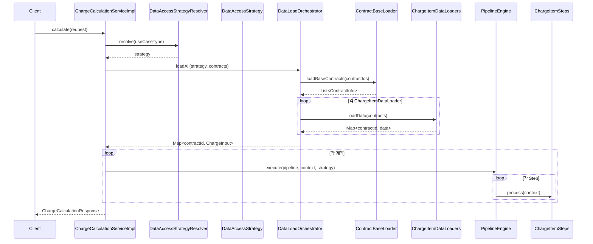
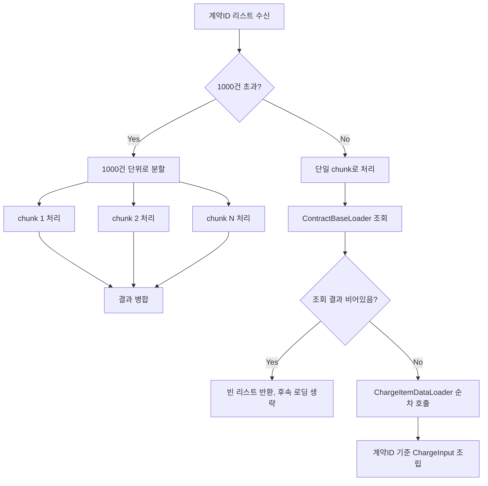
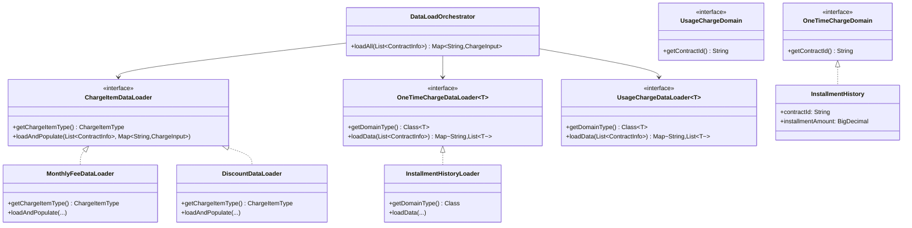

# 설계 문서: Subscription Data Load 리팩토링

## 개요

본 설계 문서는 유무선 통신 billing system의 요금 계산 모듈에서 가입자 데이터 로딩 로직을 개선하기 위한 상세 설계를 기술한다.

### 현재 문제점
기존 legacy system에서는 요금 계산에 필요한 모든 데이터를 하나의 SQL에서 수십 개의 테이블을 outer join으로 연결하여 조회한다. 이로 인해:
- SQL 복잡도가 매우 높음
- record 중복 추출 문제 발생
- I/O 비효율 존재
- 새로운 요금항목 추가 시 기존 SQL 수정 필요

### 개선 방향
- 계약 기본정보와 요금항목별 데이터를 분리 조회
- chunk 단위(최대 1000건) 일괄 조회로 DB round trip 최소화
- 제네릭 인터페이스를 활용한 OCP 준수 (새 요금항목 추가 시 기존 코드 무변경)
- DataAccessStrategy와 통합하여 유스케이스별 데이터 원천 교체 지원

### 설계 결정 근거
1. **요금항목별 분리 로더 패턴**: 각 요금항목이 독립적인 로더를 가지므로 요금항목 간 결합도가 제거된다. 새 요금항목 추가 시 새 로더 구현체만 추가하면 된다.
2. **chunk 단위 일괄 조회**: SQL IN 조건에 최대 1000건의 계약ID를 포함하여 DB round trip을 최소화한다. Oracle의 IN 절 제한(1000개)을 준수한다.
3. **제네릭 데이터 로더**: 일회성 요금, 통화료/종량료처럼 유형이 다양한 항목은 마커 인터페이스 + 제네릭 로더 패턴으로 추상화한다.
4. **Data_Load_Orchestrator 도입**: 파이프라인 실행 전 데이터 로딩을 일괄 수행하여 Step이 계산 로직에만 집중하도록 한다.

## 아키텍처

### 모듈 배치

```
billing-charge-calculation-api (타 컴포넌트 제공 인터페이스)
├── ContractInfo, ChargeCalculationRequest/Response (기존 유지)
└── (변경 없음)

billing-charge-calculation-internal (내부 전용)
├── model/
│   ├── ChargeInput (확장: oneTimeChargeData, usageChargeData, discountSubscriptions 추가)
│   ├── OneTimeChargeDomain (마커 인터페이스, 신규)
│   ├── UsageChargeDomain (마커 인터페이스, 신규)
│   └── 구체 도메인 클래스들 (InstallmentHistory, PenaltyFee 등)
├── dataloader/
│   ├── ChargeItemDataLoader (요금항목별 데이터 로더 인터페이스, 신규)
│   ├── ContractBaseLoader (계약 기본정보 로더, 신규)
│   ├── MonthlyFeeDataLoader (월정액 데이터 로더, 신규)
│   ├── DiscountDataLoader (할인 데이터 로더, 신규)
│   ├── BillingPaymentDataLoader (청구/수납 데이터 로더, 신규)
│   ├── PrepaidDataLoader (선납내역 데이터 로더, 신규)
│   ├── OneTimeChargeDataLoader<T> (일회성 제네릭 로더 인터페이스, 신규)
│   ├── UsageChargeDataLoader<T> (통화료/종량료 제네릭 로더 인터페이스, 신규)
│   └── 구체 로더 구현체들 (InstallmentHistoryLoader 등)
├── mapper/ (chunk 단위 조회 메서드 추가)
│   ├── ContractBaseMapper (신규)
│   ├── MonthlyFeeMapper (신규)
│   ├── DiscountMapper (신규)
│   ├── BillingPaymentMapper (신규)
│   └── PrepaidMapper (신규)
├── strategy/ (DataAccessStrategy 확장)
│   └── DataAccessStrategy (readChargeInputBulk 추가)
└── step/ (데이터 로딩 로직 제거, ChargeContext 데이터만 사용)

billing-charge-calculation-impl (구현체)
├── dataloader/
│   └── DataLoadOrchestrator (데이터 로딩 오케스트레이터, 신규)
└── service/
    └── ChargeCalculationServiceImpl (DataLoadOrchestrator 연동으로 변경)
```

### 전체 흐름 다이어그램



### chunk 분할 처리 흐름



## 컴포넌트 및 인터페이스

### 1. ContractBaseLoader (계약 기본정보 로더)

계약ID와 최소한의 기본 정보만을 조회하는 로더. 기준정보 테이블과의 join 없이 마스터 테이블(또는 유스케이스에 따른 원천 테이블)에서만 데이터를 조회한다.

```java
/**
 * 계약 기본정보 로더 인터페이스.
 * 유스케이스별 DataAccessStrategy 구현체에서 이 인터페이스를 구현한다.
 */
public interface ContractBaseLoader {

    /**
     * 계약ID 리스트로 기본정보를 chunk 단위 조회한다.
     * IN 조건 최대 1000건 제한을 내부에서 처리한다.
     *
     * @param contractIds 계약ID 리스트
     * @return 계약 기본정보 리스트 (조회 결과 없으면 빈 리스트)
     */
    List<ContractInfo> loadBaseContracts(List<String> contractIds);
}
```

### 2. ChargeItemDataLoader (요금항목별 데이터 로더 인터페이스)

```java
/**
 * 요금항목별 데이터 로더 인터페이스.
 * 각 요금항목(월정액, 할인, 청구/수납 등)은 이 인터페이스를 구현한다.
 * Spring 컨텍스트에 Bean으로 등록되면 DataLoadOrchestrator가 자동 인식한다.
 */
public interface ChargeItemDataLoader {

    /**
     * 이 로더가 담당하는 요금항목 유형 식별자.
     */
    ChargeItemType getChargeItemType();

    /**
     * chunk 단위로 데이터를 조회하여 계약ID별로 ChargeInput에 설정한다.
     *
     * @param contracts      chunk 내 계약정보 리스트
     * @param chargeInputMap 계약ID → ChargeInput 매핑 (로더가 해당 필드를 설정)
     */
    void loadAndPopulate(List<ContractInfo> contracts, Map<String, ChargeInput> chargeInputMap);
}
```

### 3. OneTimeChargeDataLoader (일회성 요금 제네릭 로더)

```java
/**
 * 일회성 요금 유형별 제네릭 데이터 로더.
 * OneTimeChargeDomain 구현체별로 특화된 데이터를 chunk 단위로 조회한다.
 */
public interface OneTimeChargeDataLoader<T extends OneTimeChargeDomain> {

    /**
     * 이 로더가 담당하는 일회성 요금 도메인 클래스.
     */
    Class<T> getDomainType();

    /**
     * chunk 단위로 데이터를 조회하여 계약ID별로 그룹핑하여 반환한다.
     *
     * @param contracts chunk 내 계약정보 리스트
     * @return 계약ID → 도메인 데이터 리스트 매핑
     */
    Map<String, List<T>> loadData(List<ContractInfo> contracts);
}
```

### 4. UsageChargeDataLoader (통화료/종량료 제네릭 로더)

```java
/**
 * 통화료/종량료 유형별 제네릭 데이터 로더.
 * UsageChargeDomain 구현체별로 특화된 데이터를 chunk 단위로 조회한다.
 */
public interface UsageChargeDataLoader<T extends UsageChargeDomain> {

    /**
     * 이 로더가 담당하는 통화료/종량료 도메인 클래스.
     */
    Class<T> getDomainType();

    /**
     * chunk 단위로 데이터를 조회하여 계약ID별로 그룹핑하여 반환한다.
     *
     * @param contracts chunk 내 계약정보 리스트
     * @return 계약ID → 도메인 데이터 리스트 매핑
     */
    Map<String, List<T>> loadData(List<ContractInfo> contracts);
}
```

### 5. DataLoadOrchestrator (데이터 로딩 오케스트레이터)

```java
/**
 * 요금항목별 분리 조회를 오케스트레이션하는 핵심 컴포넌트.
 * 파이프라인 실행 전 모든 데이터 로딩을 일괄 수행한다.
 * Spring 컨텍스트에 등록된 ChargeItemDataLoader, OneTimeChargeDataLoader,
 * UsageChargeDataLoader를 자동 인식한다.
 */
@Component
@RequiredArgsConstructor
public class DataLoadOrchestrator {

    private final List<ChargeItemDataLoader> chargeItemDataLoaders;
    private final List<OneTimeChargeDataLoader<?>> oneTimeChargeDataLoaders;
    private final List<UsageChargeDataLoader<?>> usageChargeDataLoaders;

    /**
     * chunk 단위로 모든 요금항목 데이터를 로딩하여 계약별 ChargeInput을 조립한다.
     * 1000건 초과 시 내부에서 분할 처리한다.
     *
     * @param baseContracts 계약 기본정보 리스트
     * @return 계약ID → ChargeInput 매핑
     */
    public Map<String, ChargeInput> loadAll(List<ContractInfo> baseContracts) {
        // 1. ChargeInput 초기화
        // 2. ChargeItemDataLoader 순차 호출
        // 3. OneTimeChargeDataLoader 순차 호출 → ChargeInput에 설정
        // 4. UsageChargeDataLoader 순차 호출 → ChargeInput에 설정
        // 5. 계약ID → ChargeInput 매핑 반환
    }
}
```

### 6. DataAccessStrategy 확장

기존 `readChargeInput(ContractInfo)` 단건 조회 메서드에 더해, chunk 단위 일괄 조회를 지원하는 메서드를 추가한다.

```java
public interface DataAccessStrategy {
    // ... 기존 메서드 유지 ...

    /**
     * 이 전략에 해당하는 ContractBaseLoader를 반환한다.
     */
    ContractBaseLoader getContractBaseLoader();

    /**
     * 이 전략에 해당하는 ChargeItemDataLoader 목록을 반환한다.
     */
    List<ChargeItemDataLoader> getChargeItemDataLoaders();
}
```

### 7. ChargeInput 모델 확장

```java
@Data
@Builder
@NoArgsConstructor
@AllArgsConstructor
public class ChargeInput {
    // 기존 필드 유지
    private SubscriptionInfo subscriptionInfo;
    private List<SuspensionHistory> suspensionHistories;
    private BillingInfo billingInfo;
    private PaymentInfo paymentInfo;
    private List<PrepaidRecord> prepaidRecords;

    // 신규 필드
    /** 할인 가입정보 리스트 */
    private List<DiscountSubscription> discountSubscriptions;

    /** 일회성 요금 도메인 데이터 (유형별 저장) */
    private Map<Class<? extends OneTimeChargeDomain>, List<? extends OneTimeChargeDomain>> oneTimeChargeDataMap;

    /** 통화료/종량료 도메인 데이터 (유형별 저장) */
    private Map<Class<? extends UsageChargeDomain>, List<? extends UsageChargeDomain>> usageChargeDataMap;
}
```

### 8. Step 변경 방향

기존 Step들은 데이터 로딩 로직을 제거하고, ChargeContext에 이미 적재된 ChargeInput 데이터만 사용하도록 변경한다.

```java
// OneTimeFeeStep 변경 예시
@Override
public void process(ChargeContext context) {
    Map<Class<? extends OneTimeChargeDomain>, List<? extends OneTimeChargeDomain>> dataMap =
        context.getChargeInput().getOneTimeChargeDataMap();

    if (dataMap == null || dataMap.isEmpty()) {
        return; // 데이터 없으면 생략
    }

    // 등록된 각 일회성 요금 유형별로 계산 로직 호출
    for (var entry : dataMap.entrySet()) {
        // OneTimeChargeCalculator를 통해 유형별 계산 수행
    }
}
```

## 데이터 모델

### 신규 마커 인터페이스

```java
/** 일회성 요금 도메인 마커 인터페이스 */
public interface OneTimeChargeDomain {
    String getContractId();
}

/** 통화료/종량료 도메인 마커 인터페이스 */
public interface UsageChargeDomain {
    String getContractId();
}
```

### 구체 도메인 클래스 예시

```java
/** 할부이력 */
@Data @Builder @NoArgsConstructor @AllArgsConstructor
public class InstallmentHistory implements OneTimeChargeDomain {
    private String contractId;
    private String installmentId;
    private BigDecimal installmentAmount;
    private int currentInstallment;
    private int totalInstallments;
}

/** 위약금 */
@Data @Builder @NoArgsConstructor @AllArgsConstructor
public class PenaltyFee implements OneTimeChargeDomain {
    private String contractId;
    private String penaltyId;
    private BigDecimal penaltyAmount;
    private String penaltyReason;
}

/** 음성통화 사용량 */
@Data @Builder @NoArgsConstructor @AllArgsConstructor
public class VoiceUsage implements UsageChargeDomain {
    private String contractId;
    private String usageId;
    private BigDecimal duration;       // 통화시간(초)
    private BigDecimal unitPrice;      // 단가
}

/** 데이터 사용량 */
@Data @Builder @NoArgsConstructor @AllArgsConstructor
public class DataUsage implements UsageChargeDomain {
    private String contractId;
    private String usageId;
    private BigDecimal dataVolume;     // 사용량(MB)
    private BigDecimal unitPrice;      // 단가
}
```

### 할인 가입정보 모델

```java
/** 할인 가입정보 */
@Data @Builder @NoArgsConstructor @AllArgsConstructor
public class DiscountSubscription {
    private String contractId;
    private String discountId;
    private String discountCode;
    private String discountName;
    private LocalDate startDate;
    private LocalDate endDate;
}
```

### ChargeInput 확장 후 전체 구조

```java
@Data @Builder @NoArgsConstructor @AllArgsConstructor
public class ChargeInput {
    // === 기존 필드 (하위 호환) ===
    private SubscriptionInfo subscriptionInfo;
    private List<SuspensionHistory> suspensionHistories;
    private BillingInfo billingInfo;
    private PaymentInfo paymentInfo;
    private List<PrepaidRecord> prepaidRecords;

    // === 신규 필드 ===
    /** 할인 가입정보 */
    private List<DiscountSubscription> discountSubscriptions;

    /** 일회성 요금 도메인 데이터 (유형별) */
    @Builder.Default
    private Map<Class<? extends OneTimeChargeDomain>, List<? extends OneTimeChargeDomain>> oneTimeChargeDataMap = new HashMap<>();

    /** 통화료/종량료 도메인 데이터 (유형별) */
    @Builder.Default
    private Map<Class<? extends UsageChargeDomain>, List<? extends UsageChargeDomain>> usageChargeDataMap = new HashMap<>();

    // === 유틸리티 메서드 ===
    @SuppressWarnings("unchecked")
    public <T extends OneTimeChargeDomain> List<T> getOneTimeChargeData(Class<T> type) {
        List<? extends OneTimeChargeDomain> data = oneTimeChargeDataMap.get(type);
        return data != null ? (List<T>) data : List.of();
    }

    @SuppressWarnings("unchecked")
    public <T extends UsageChargeDomain> List<T> getUsageChargeData(Class<T> type) {
        List<? extends UsageChargeDomain> data = usageChargeDataMap.get(type);
        return data != null ? (List<T>) data : List.of();
    }

    public <T extends OneTimeChargeDomain> void putOneTimeChargeData(Class<T> type, List<T> data) {
        oneTimeChargeDataMap.put(type, data);
    }

    public <T extends UsageChargeDomain> void putUsageChargeData(Class<T> type, List<T> data) {
        usageChargeDataMap.put(type, data);
    }
}
```

### MyBatis Mapper 인터페이스 (신규)

```java
@Mapper
public interface ContractBaseMapper {
    List<ContractInfo> selectBaseContracts(@Param("contractIds") List<String> contractIds);
}

@Mapper
public interface MonthlyFeeMapper {
    List<SubscriptionInfo> selectSubscriptionInfos(@Param("contractIds") List<String> contractIds);
    List<SuspensionHistory> selectSuspensionHistories(@Param("contractIds") List<String> contractIds);
}

@Mapper
public interface DiscountMapper {
    List<DiscountSubscription> selectDiscountSubscriptions(@Param("contractIds") List<String> contractIds);
}

@Mapper
public interface BillingPaymentMapper {
    List<BillingInfo> selectBillingInfos(@Param("contractIds") List<String> contractIds);
    List<PaymentInfo> selectPaymentInfos(@Param("contractIds") List<String> contractIds);
}

@Mapper
public interface PrepaidMapper {
    List<PrepaidRecord> selectPrepaidRecords(@Param("contractIds") List<String> contractIds);
}
```

### 클래스 다이어그램




## 정합성 속성 (Correctness Properties)

*속성(property)이란 시스템의 모든 유효한 실행에서 참이어야 하는 특성 또는 동작이다. 속성은 사람이 읽을 수 있는 명세와 기계가 검증할 수 있는 정합성 보장 사이의 다리 역할을 한다.*

### Property 1: chunk 분할 시 원소 보존 및 크기 제한

*임의의* 크기 N의 계약ID 리스트에 대해, 1000건 단위로 분할하면:
- 각 chunk의 크기는 1000건 이하이다
- 모든 chunk를 합치면 원본 리스트와 동일한 원소를 포함한다 (순서 보존)
- chunk 개수는 ceil(N / 1000)이다

**Validates: Requirements 1.3, 1.4, 8.5**

### Property 2: 계약ID 기준 그룹핑 정합성

*임의의* contractId를 가진 데이터 리스트에 대해, 계약ID 기준으로 그룹핑하면:
- 결과 Map의 각 key에 대응하는 value 리스트의 모든 항목은 해당 contractId를 가진다
- 원본 리스트의 모든 항목이 결과 Map 어딘가에 존재한다 (데이터 유실 없음)
- 결과 Map의 모든 항목 수 합계는 원본 리스트의 크기와 동일하다

**Validates: Requirements 2.3, 3.3, 4.5, 5.5, 6.2, 8.3, 9.2, 10.3, 11.2**

### Property 3: ChargeInput 도메인 데이터 저장/조회 round-trip

*임의의* OneTimeChargeDomain 또는 UsageChargeDomain 구현체 리스트를 ChargeInput에 저장(put)한 후, 동일한 Class 타입으로 조회(get)하면 저장한 것과 동일한 리스트가 반환된다.

**Validates: Requirements 13.2, 13.3**

### Property 4: Step 데이터 부재 시 안전한 생략

*임의의* ChargeItemStep 구현체에 대해, 해당 Step에 필요한 데이터가 ChargeContext에 존재하지 않으면:
- 예외가 발생하지 않는다
- ChargeContext의 결과 리스트(periodResults, flatResults)에 새로운 항목이 추가되지 않는다

**Validates: Requirements 12.3**

### Property 5: 오케스트레이터 전체 로더 호출

*임의의* N개의 ChargeItemDataLoader가 등록된 DataLoadOrchestrator에 대해, loadAll을 호출하면 등록된 모든 N개의 로더가 호출된다.

**Validates: Requirements 6.1**

### Property 6: Step의 모든 등록 유형 데이터 처리

*임의의* N개 유형의 OneTimeChargeDomain(또는 UsageChargeDomain) 데이터가 ChargeInput에 존재할 때, 해당 Step(OneTimeFeeStep 또는 UsageFeeStep)을 실행하면 모든 N개 유형의 데이터에 대해 계산 결과가 생성된다.

**Validates: Requirements 4.4, 5.4, 12.4, 12.5**

## 오류 처리

### 1. 데이터 로딩 오류

| 오류 상황 | 처리 방식 |
|-----------|-----------|
| ContractBaseLoader 조회 결과 비어있음 | 빈 리스트 반환, 후속 로더 호출 생략 (정상 흐름) |
| 개별 ChargeItemDataLoader 조회 실패 | 해당 로더의 예외를 DataLoadOrchestrator에서 catch하여 로깅 후, 해당 요금항목 데이터 없이 진행할지 또는 전체 실패 처리할지 정책 결정 필요 |
| chunk 분할 시 빈 리스트 입력 | 빈 Map 반환 (정상 흐름) |
| 1000건 초과 분할 중 일부 chunk 실패 | 실패한 chunk에 포함된 계약만 실패 처리, 나머지 chunk는 계속 진행 |

### 2. 데이터 매핑 오류

| 오류 상황 | 처리 방식 |
|-----------|-----------|
| 조회 결과에 contractId가 null인 데이터 존재 | 해당 데이터 무시하고 로깅 |
| ChargeInput에 해당 유형의 데이터가 없음 | Step에서 안전하게 생략 (Property 4) |
| 동일 contractId에 대해 중복 데이터 존재 | 리스트에 모두 포함 (중복 제거는 비즈니스 로직에서 처리) |

### 3. 기존 예외 체계 활용

- `StepExecutionException`: Step 실행 중 오류 (기존 유지)
- `ProcessingStatusUpdateException`: 처리 상태 DB 갱신 오류 (기존 유지)
- `InvalidRequestException`: 요청 유효성 검증 실패 (기존 유지)
- 신규: `DataLoadException` 추가 검토 - 데이터 로딩 단계에서 발생하는 오류를 구분하기 위한 전용 예외

## 테스트 전략

### 이중 테스트 접근법

본 설계는 단위 테스트와 속성 기반 테스트(Property-Based Testing)를 병행하여 포괄적인 검증을 수행한다.

### 단위 테스트 (JUnit 5)

단위 테스트는 구체적인 예시, 엣지 케이스, 오류 조건에 집중한다.

- **ContractBaseLoader**: 빈 리스트 입력 시 빈 결과 반환 확인 (요구사항 1.6)
- **DataAccessStrategy 유스케이스별 로더 선택**: 정기청구 → 마스터 테이블 로더, 예상 조회 → 접수 테이블 로더, 견적 조회 → 기준정보 로더 (요구사항 7.2, 7.3, 7.4)
- **OLTP 단건 처리**: 단건 ContractInfo 입력 시 동일 인터페이스로 정상 동작 확인 (요구사항 8.4)
- **DataLoadOrchestrator**: ChargeInput이 ChargeContext에 정상 설정되는지 확인 (요구사항 6.4)
- **Step 데이터 부재 시 생략**: 각 Step에 빈 ChargeInput 전달 시 예외 없이 정상 종료 확인

### 속성 기반 테스트 (jqwik)

속성 기반 테스트는 설계 문서의 정합성 속성을 검증한다. 각 테스트는 최소 100회 반복 실행한다.

- 각 속성 테스트는 설계 문서의 Property 번호를 참조하는 태그를 포함한다
- 태그 형식: `Feature: subscription-data-load-refactor, Property {번호}: {속성명}`
- 각 정합성 속성은 하나의 속성 기반 테스트로 구현한다

| Property | 테스트 대상 | 생성기 |
|----------|------------|--------|
| Property 1 | chunk 분할 유틸리티 | 임의 크기(0~5000)의 String 리스트 |
| Property 2 | 그룹핑 유틸리티 | 임의의 contractId를 가진 도메인 객체 리스트 |
| Property 3 | ChargeInput put/get | 임의의 OneTimeChargeDomain/UsageChargeDomain 구현체 리스트 |
| Property 4 | 각 ChargeItemStep | 빈 또는 불완전한 ChargeInput을 가진 ChargeContext |
| Property 5 | DataLoadOrchestrator | 임의의 N개 mock ChargeItemDataLoader |
| Property 6 | OneTimeFeeStep, UsageFeeStep | 임의의 N개 유형의 도메인 데이터를 가진 ChargeInput |

### 속성 기반 테스트 라이브러리

- **jqwik 1.9.2** (이미 프로젝트에 의존성 추가됨)
- JUnit Platform 위에서 동작하며 기존 테스트 인프라와 호환
- `@Property` 어노테이션으로 속성 테스트 정의
- `@ForAll` 어노테이션으로 임의 입력 생성
- 최소 100회 반복: `@Property(tries = 100)`
