# 요금 계산 시스템 아키텍처 다이어그램

## 1. 시퀀스 다이어그램

### 1.1 전체 요금 계산 흐름

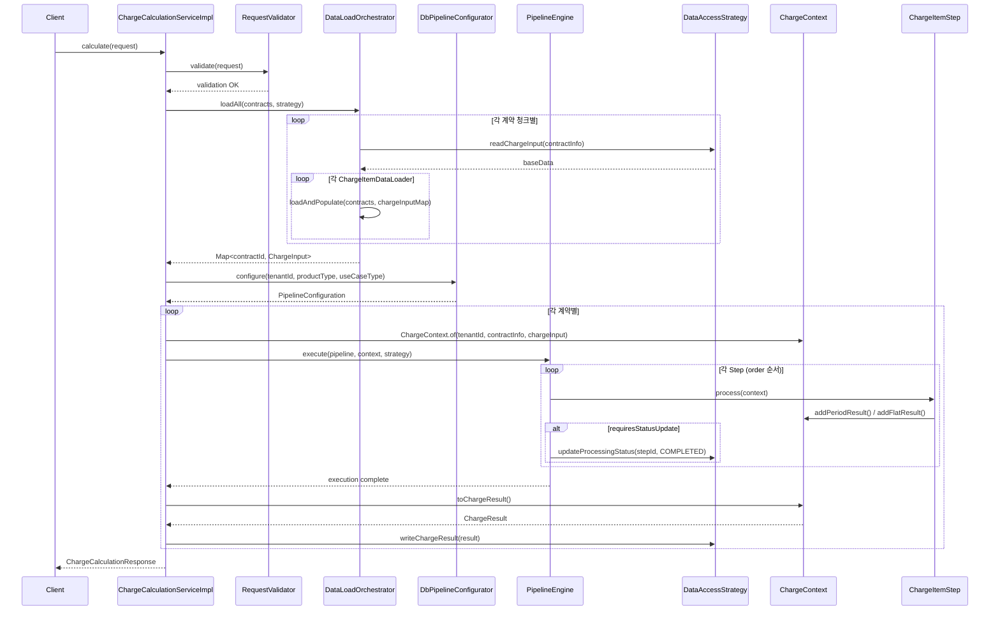

### 1.2 데이터 로딩 상세 흐름

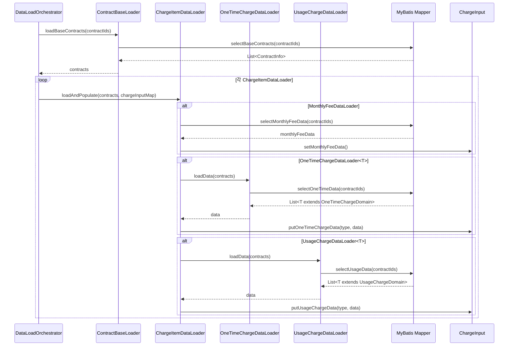


### 1.3 Pipeline 실행 상세 흐름

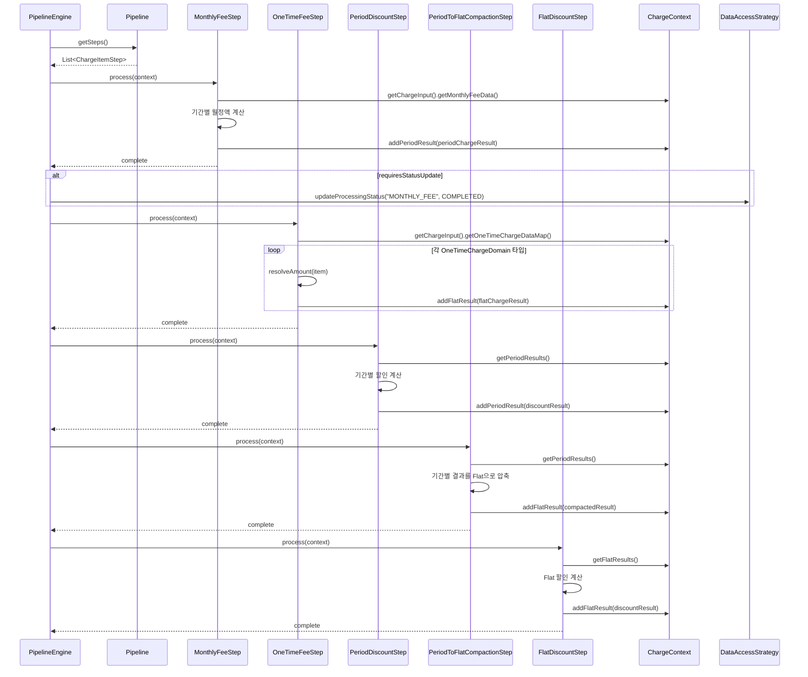

### 1.4 배치 처리 흐름

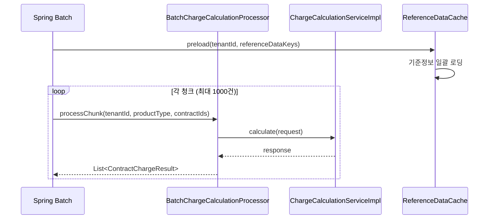


## 2. 클래스 다이어그램

### 2.1 전체 아키텍처 레이어 구조

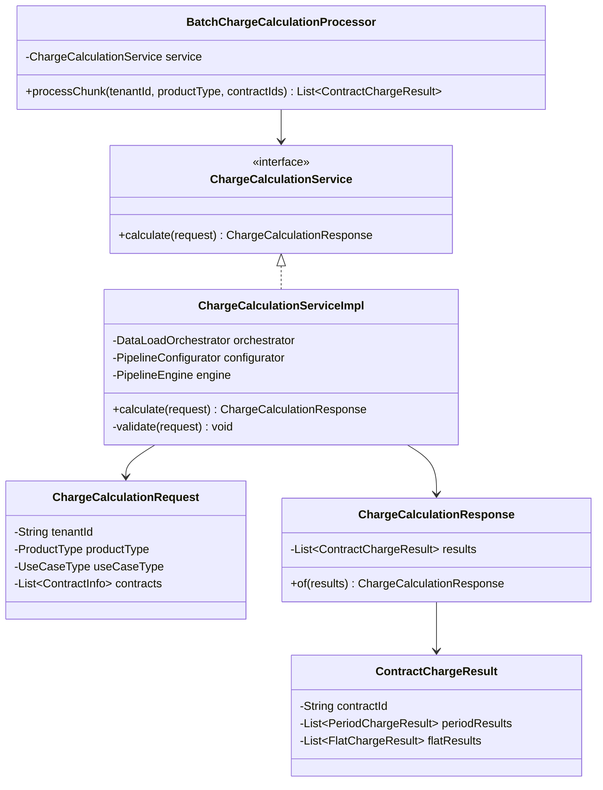

### 2.2 데이터 로딩 구조

```mermaid
classDiagram
    %% Orchestrator
    class DataLoadOrchestrator {
        -ContractBaseLoader baseLoader
        -List~ChargeItemDataLoader~ itemLoaders
        -List~OneTimeChargeDataLoader~ oneTimeLoaders
        -List~UsageChargeDataLoader~ usageLoaders
        +loadAll(contracts, strategy) Map~String, ChargeInput~
        -loadBaseContractsInChunks(contractIds) List~ContractInfo~
        -populateOneTimeChargeData(loader, contracts, map) void
        -populateUsageChargeData(loader, contracts, map) void
    }
    
    %% Base Loader
    class ContractBaseLoader {
        <<interface>>
        +loadBaseContracts(contractIds) List~ContractInfo~
    }
    
    class MasterContractBaseLoader {
        -MasterTableMapper mapper
        +loadBaseContracts(contractIds) List~ContractInfo~
    }
    
    %% Item Loader
    class ChargeItemDataLoader {
        <<interface>>
        +getChargeItemType() ChargeItemType
        +loadAndPopulate(contracts, chargeInputMap) void
    }
    
    class MonthlyFeeDataLoader {
        -MasterTableMapper mapper
        +getChargeItemType() ChargeItemType
        +loadAndPopulate(contracts, chargeInputMap) void
    }
    
    class DiscountDataLoader {
        -MasterTableMapper mapper
        +getChargeItemType() ChargeItemType
        +loadAndPopulate(contracts, chargeInputMap) void
    }
    
    class BillingPaymentDataLoader {
        -MasterTableMapper mapper
        +getChargeItemType() ChargeItemType
        +loadAndPopulate(contracts, chargeInputMap) void
    }
    
    %% Generic Loaders
    class OneTimeChargeDataLoader~T~ {
        <<interface>>
        +loadData(contracts) List~T~
    }
    
    class UsageChargeDataLoader~T~ {
        <<interface>>
        +loadData(contracts) List~T~
    }
    
    class InstallmentHistoryLoader {
        -MasterTableMapper mapper
        +loadData(contracts) List~InstallmentHistory~
    }
    
    class VoiceUsageLoader {
        -MasterTableMapper mapper
        +loadData(contracts) List~VoiceUsage~
    }
    
    class DataUsageLoader {
        -MasterTableMapper mapper
        +loadData(contracts) List~DataUsage~
    }
    
    %% Relationships
    DataLoadOrchestrator --> ContractBaseLoader
    DataLoadOrchestrator --> ChargeItemDataLoader
    DataLoadOrchestrator --> OneTimeChargeDataLoader
    DataLoadOrchestrator --> UsageChargeDataLoader
    
    ContractBaseLoader <|.. MasterContractBaseLoader
    ChargeItemDataLoader <|.. MonthlyFeeDataLoader
    ChargeItemDataLoader <|.. DiscountDataLoader
    ChargeItemDataLoader <|.. BillingPaymentDataLoader
    
    OneTimeChargeDataLoader <|.. InstallmentHistoryLoader
    UsageChargeDataLoader <|.. VoiceUsageLoader
    UsageChargeDataLoader <|.. DataUsageLoader
```


### 2.3 도메인 모델 구조

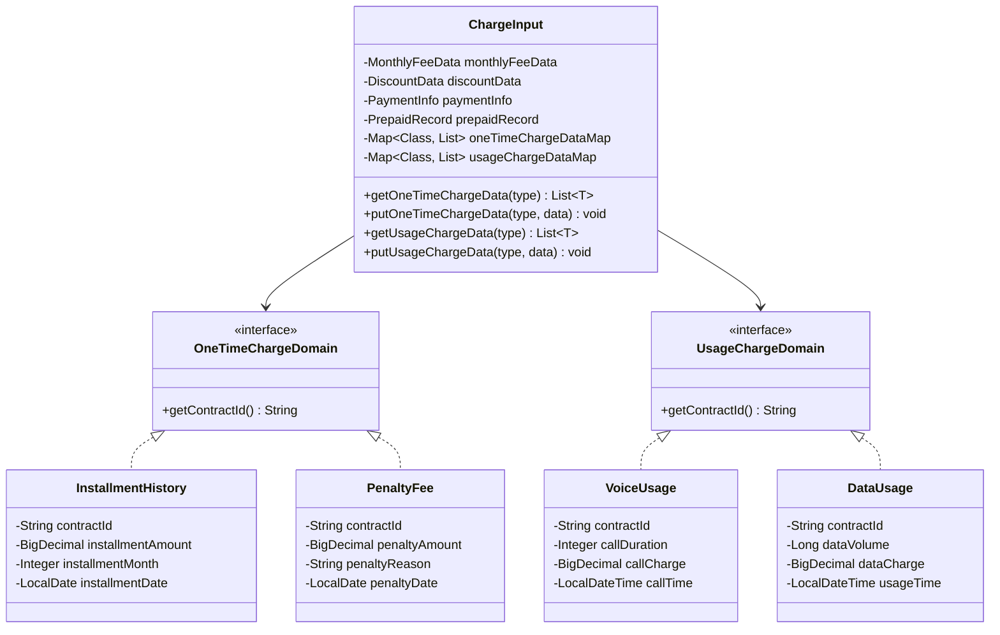

### 2.4 Pipeline 및 Step 구조

```mermaid
classDiagram
    %% Pipeline Configuration
    class PipelineConfigurator {
        <<interface>>
        +configure(tenantId, productType, useCaseType) PipelineConfiguration
    }
    
    class DbPipelineConfigurator {
        -PipelineConfigMapper mapper
        -Map~String, ChargeItemStep~ stepRegistry
        +configure(tenantId, productType, useCaseType) PipelineConfiguration
    }
    
    class DefaultPipelineConfigurator {
        -DbPipelineConfigurator dbConfigurator
        +configure(tenantId, productType, useCaseType) PipelineConfiguration
    }
    
    class PipelineConfiguration {
        -String pipelineId
        -List~StepConfig~ stepConfigs
    }
    
    class Pipeline {
        -String pipelineId
        -List~ChargeItemStep~ steps
        +getSteps() List~ChargeItemStep~
    }
    
    %% Pipeline Engine
    class PipelineEngine {
        +execute(pipeline, context, strategy) void
    }
    
    %% Step Interface
    class ChargeItemStep {
        <<interface>>
        +getStepId() String
        +getOrder() int
        +process(context) void
        +requiresStatusUpdate() boolean
    }
    
    %% Step Implementations
    class MonthlyFeeStep {
        -ReferenceDataCache cache
        +getStepId() String
        +getOrder() int
        +process(context) void
        +requiresStatusUpdate() boolean
    }
    
    class OneTimeFeeStep {
        +getStepId() String
        +getOrder() int
        +process(context) void
        +requiresStatusUpdate() boolean
        -processOneTimeChargeType(type, items, context) void
        -resolveAmount(item) BigDecimal
    }
    
    class UsageFeeStep {
        +getStepId() String
        +getOrder() int
        +process(context) void
        +requiresStatusUpdate() boolean
        -processUsageChargeType(type, items, context) void
        -resolveAmount(item) BigDecimal
    }
    
    class PeriodDiscountStep {
        -ReferenceDataCache cache
        +getStepId() String
        +getOrder() int
        +process(context) void
        +requiresStatusUpdate() boolean
    }
    
    class PeriodToFlatCompactionStep {
        +getStepId() String
        +getOrder() int
        +process(context) void
        +requiresStatusUpdate() boolean
    }
    
    class FlatDiscountStep {
        -ReferenceDataCache cache
        +getStepId() String
        +getOrder() int
        +process(context) void
        +requiresStatusUpdate() boolean
    }
    
    class LateFeeStep {
        +getStepId() String
        +getOrder() int
        +process(context) void
        +requiresStatusUpdate() boolean
    }
    
    class AutoPayDiscountStep {
        -ReferenceDataCache cache
        +getStepId() String
        +getOrder() int
        +process(context) void
        +requiresStatusUpdate() boolean
    }
    
    class TaxStep {
        -ReferenceDataCache cache
        +getStepId() String
        +getOrder() int
        +process(context) void
        +requiresStatusUpdate() boolean
    }
    
    class PrepaidOffsetStep {
        +getStepId() String
        +getOrder() int
        +process(context) void
        +requiresStatusUpdate() boolean
    }
    
    class SplitBillingStep {
        -ReferenceDataCache cache
        +getStepId() String
        +getOrder() int
        +process(context) void
        +requiresStatusUpdate() boolean
    }
    
    %% Relationships
    PipelineConfigurator <|.. DbPipelineConfigurator
    PipelineConfigurator <|.. DefaultPipelineConfigurator
    DefaultPipelineConfigurator --> DbPipelineConfigurator
    PipelineConfigurator --> PipelineConfiguration
    Pipeline --> ChargeItemStep
    PipelineEngine --> Pipeline
    
    ChargeItemStep <|.. MonthlyFeeStep
    ChargeItemStep <|.. OneTimeFeeStep
    ChargeItemStep <|.. UsageFeeStep
    ChargeItemStep <|.. PeriodDiscountStep
    ChargeItemStep <|.. PeriodToFlatCompactionStep
    ChargeItemStep <|.. FlatDiscountStep
    ChargeItemStep <|.. LateFeeStep
    ChargeItemStep <|.. AutoPayDiscountStep
    ChargeItemStep <|.. TaxStep
    ChargeItemStep <|.. PrepaidOffsetStep
    ChargeItemStep <|.. SplitBillingStep
```


### 2.5 Strategy Pattern 구조

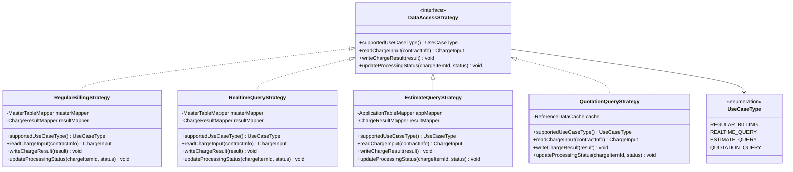

### 2.6 Context 및 Result 구조

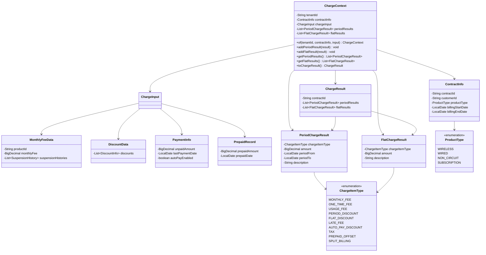


### 2.7 캐시 구조

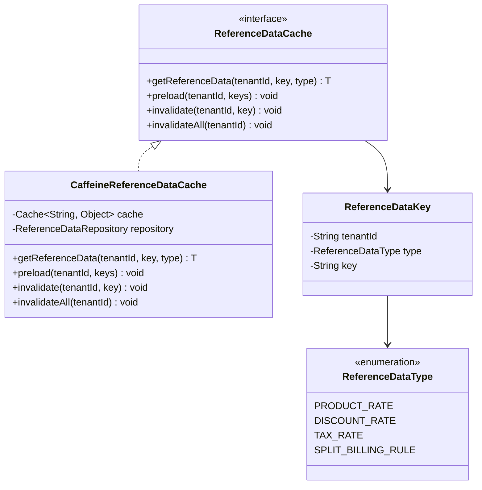


## 3. 주요 설계 패턴 및 원칙

### 3.1 적용된 디자인 패턴

1. **Strategy Pattern (전략 패턴)**
   - `DataAccessStrategy`: 유스케이스별 데이터 접근 방식을 캡슐화
   - 정기청구, 실시간 조회, 예상 조회, 견적 조회 각각의 전략 구현
   - OCP 원칙 준수: 새로운 유스케이스 추가 시 기존 코드 수정 불필요

2. **Pipeline Pattern (파이프라인 패턴)**
   - `Pipeline` + `ChargeItemStep`: 요금 계산 단계를 순차적으로 실행
   - DB 기반 동적 파이프라인 구성 (테넌트, 상품유형, 유스케이스별)
   - Step 추가/제거/순서 변경이 용이

3. **Template Method Pattern (템플릿 메서드 패턴)**
   - `ChargeItemStep` 인터페이스: 공통 실행 흐름 정의
   - 각 Step 구현체: 구체적인 계산 로직 구현

4. **Generic Type Pattern (제네릭 타입 패턴)**
   - `OneTimeChargeDataLoader<T>`, `UsageChargeDataLoader<T>`
   - 타입 안정성 보장하면서 다양한 요금 유형 지원
   - 새로운 요금 유형 추가 시 기존 로직 변경 불필요 (OCP)

5. **Orchestrator Pattern (오케스트레이터 패턴)**
   - `DataLoadOrchestrator`: 복잡한 데이터 로딩 프로세스 조율
   - 청크 단위 처리로 DB 라운드트립 최소화

6. **Cache-Aside Pattern (캐시 어사이드 패턴)**
   - `ReferenceDataCache`: 기준정보 캐싱
   - 배치: 사전 로딩, OLTP: 지연 로딩 + 무효화

### 3.2 SOLID 원칙 적용

1. **SRP (Single Responsibility Principle)**
   - 각 Step은 하나의 요금 항목 계산만 담당
   - DataLoader는 데이터 로딩만, Step은 계산만 담당

2. **OCP (Open-Closed Principle)**
   - Strategy 패턴으로 유스케이스 확장 가능
   - Generic Loader로 새로운 요금 유형 추가 가능
   - Pipeline 구성으로 Step 조합 변경 가능

3. **LSP (Liskov Substitution Principle)**
   - 모든 Strategy 구현체는 DataAccessStrategy로 대체 가능
   - 모든 Step 구현체는 ChargeItemStep으로 대체 가능

4. **ISP (Interface Segregation Principle)**
   - ChargeItemDataLoader, OneTimeChargeDataLoader, UsageChargeDataLoader 분리
   - 각 인터페이스는 필요한 메서드만 정의

5. **DIP (Dependency Inversion Principle)**
   - 상위 모듈(Service, Engine)은 인터페이스에 의존
   - 구체 구현체는 Spring DI로 주입


### 3.3 멀티테넌시 지원

- 모든 요청에 `tenantId` 포함
- Pipeline 구성이 테넌트별로 다를 수 있음
- 캐시 키에 테넌트 ID 포함하여 격리
- DB 파티셔닝 또는 스키마 분리 가능

### 3.4 성능 최적화

1. **청크 단위 처리**
   - 최대 1000건씩 묶어서 처리
   - DB 라운드트립 최소화
   - IN 절 활용한 배치 조회

2. **기준정보 캐싱**
   - Caffeine 캐시 사용
   - 배치: 사전 로딩으로 조회 횟수 최소화
   - OLTP: 지연 로딩 + TTL 기반 무효화

3. **불필요한 조인 제거**
   - 레거시: 수십 개 테이블 OUTER JOIN
   - 신규: 필요한 데이터만 개별 조회 후 메모리 조합

4. **기간별 결과 압축**
   - PeriodToFlatCompactionStep: 기간 정보 제거 및 집계
   - 후속 Step의 처리량 감소

## 4. 컴포넌트 구조

### 4.1 JAR 구성

```
billing-charge-calculation/
├── billing-charge-calculation-api/          (API JAR)
│   └── 타 컴포넌트에 제공할 인터페이스
│       ├── ChargeCalculationService
│       ├── DTO (Request, Response, ContractInfo 등)
│       ├── Enum (ChargeItemType, UseCaseType 등)
│       └── Exception
│
├── billing-charge-calculation-impl/         (Implementation JAR)
│   └── API 구현체 + 외부 의존성
│       ├── ChargeCalculationServiceImpl
│       ├── BatchChargeCalculationProcessor
│       ├── DataLoadOrchestrator
│       ├── PipelineEngine
│       ├── PipelineConfigurator
│       └── Cache (ReferenceDataCache)
│
└── billing-charge-calculation-internal/     (Internal JAR)
    └── 내부 전용 기능
        ├── Step 구현체들
        ├── Strategy 구현체들
        ├── DataLoader 구현체들
        ├── Domain Model (OneTimeChargeDomain 등)
        ├── Context (ChargeContext)
        └── Utility
```

### 4.2 의존성 방향

```
API ← Implementation ← Internal
 ↑
 └─ 타 컴포넌트는 API만 의존
```

## 5. 확장 포인트

### 5.1 새로운 요금 항목 추가

1. Domain 클래스 생성 (OneTimeChargeDomain 또는 UsageChargeDomain 구현)
2. DataLoader 구현
3. Step 구현 (필요시)
4. DB에 Pipeline 구성 추가

### 5.2 새로운 유스케이스 추가

1. DataAccessStrategy 구현체 추가
2. UseCaseType enum에 추가
3. DB에 Pipeline 구성 추가

### 5.3 새로운 Step 추가

1. ChargeItemStep 구현
2. Spring Bean 등록
3. DB에 Step 구성 추가
