# 요금 계산 모듈 통합 UML 다이어그램

본 문서는 billing-charge-calculation 모듈의 전체 아키텍처를 시각화한 통합 UML 다이어그램을 제공합니다.

## 목차
1. [전체 시스템 아키텍처](#1-전체-시스템-아키텍처)
2. [3-Jar 모듈 구조](#2-3-jar-모듈-구조)
3. [전체 처리 흐름 시퀀스](#3-전체-처리-흐름-시퀀스)
4. [데이터 로딩 상세 시퀀스](#4-데이터-로딩-상세-시퀀스)
5. [Pipeline 기반 DataLoader 선택 시퀀스](#5-pipeline-기반-dataloader-선택-시퀀스)
6. [핵심 컴포넌트 클래스 다이어그램](#6-핵심-컴포넌트-클래스-다이어그램)
7. [Strategy 패턴 클래스 다이어그램](#7-strategy-패턴-클래스-다이어그램)
8. [Step 계층 구조](#8-step-계층-구조)
9. [DataLoader 계층 구조](#9-dataloader-계층-구조)
10. [Domain Model 구조](#10-domain-model-구조)
11. [Pipeline 구성 및 실행](#11-pipeline-구성-및-실행)
12. [캐시 아키텍처](#12-캐시-아키텍처)
13. [예외 계층 구조](#13-예외-계층-구조)

---

## 1. 전체 시스템 아키텍처

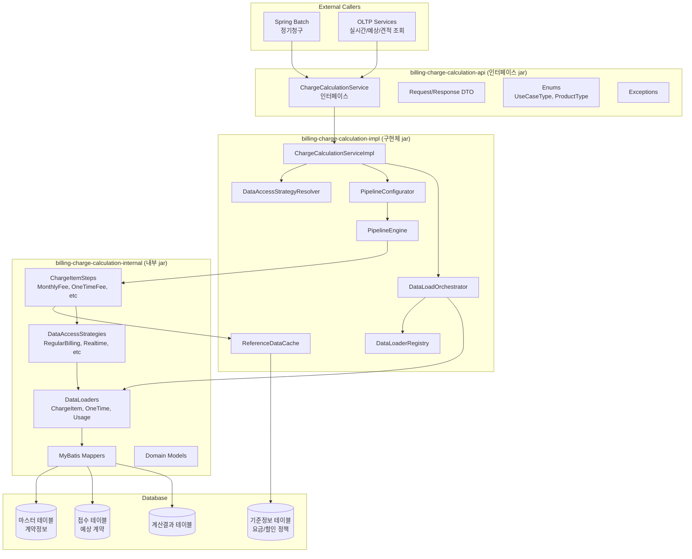

---

## 2. 3-Jar 모듈 구조

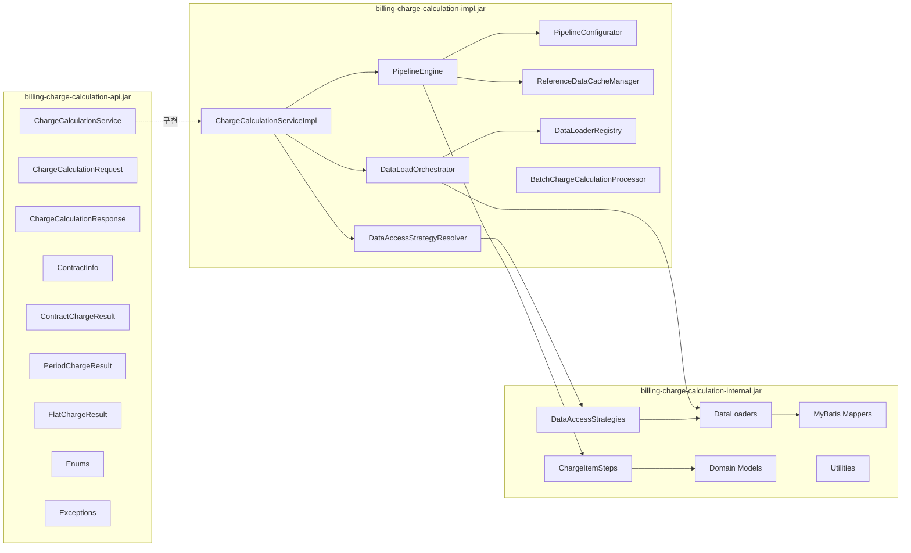

---

## 3. 전체 처리 흐름 시퀀스

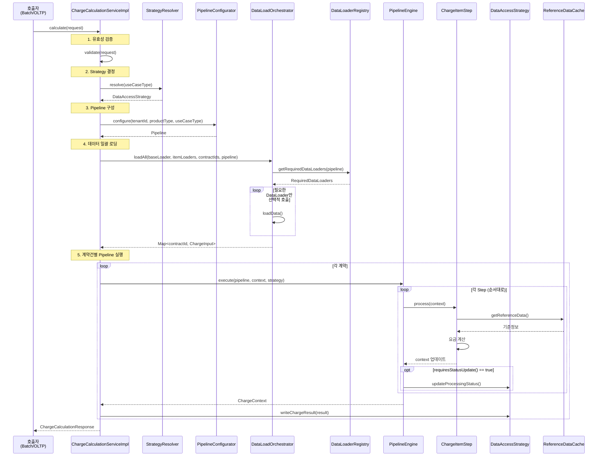

---

## 4. 데이터 로딩 상세 시퀀스

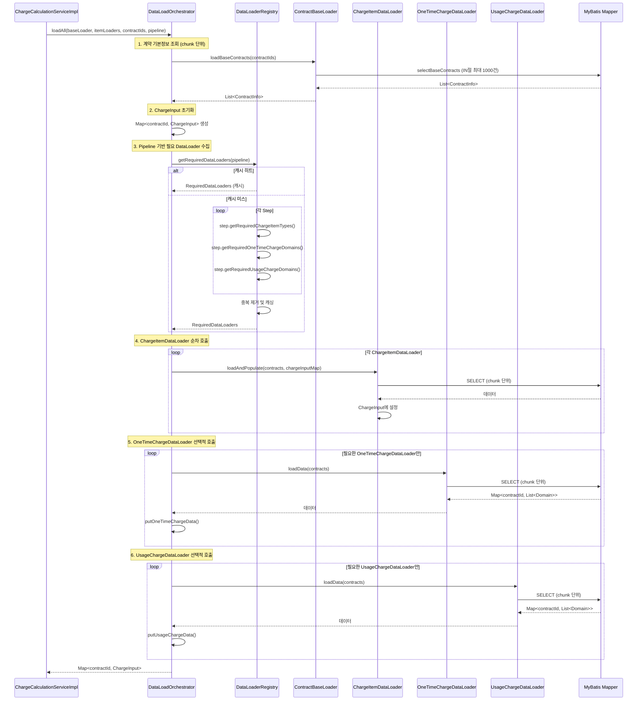

---

## 5. Pipeline 기반 DataLoader 선택 시퀀스

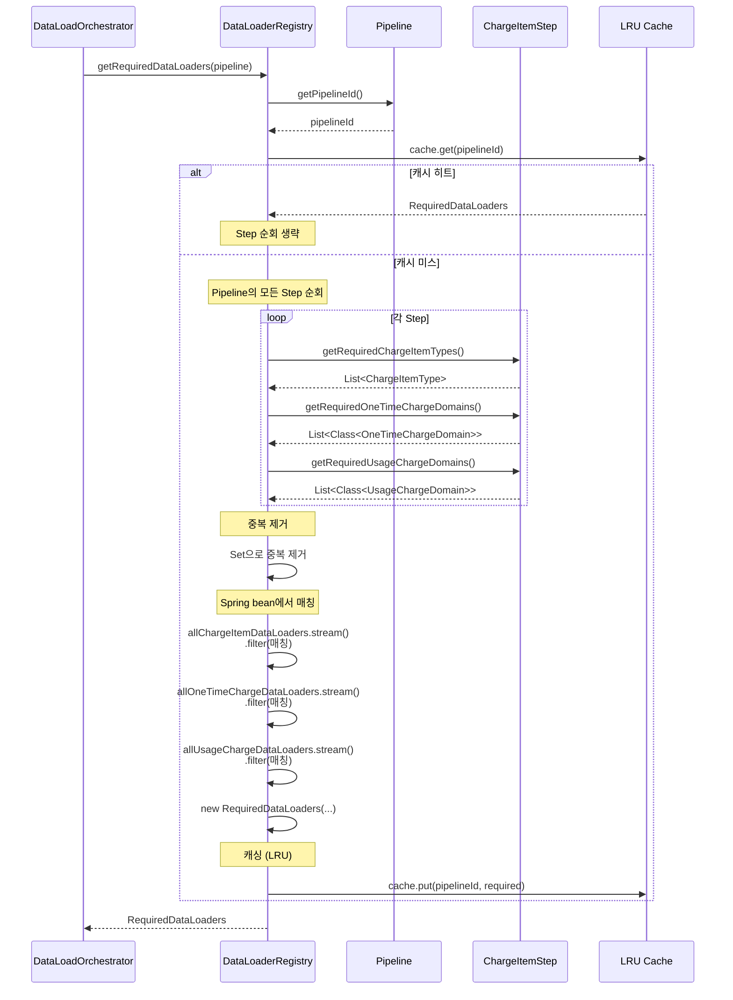

---

## 6. 핵심 컴포넌트 클래스 다이어그램

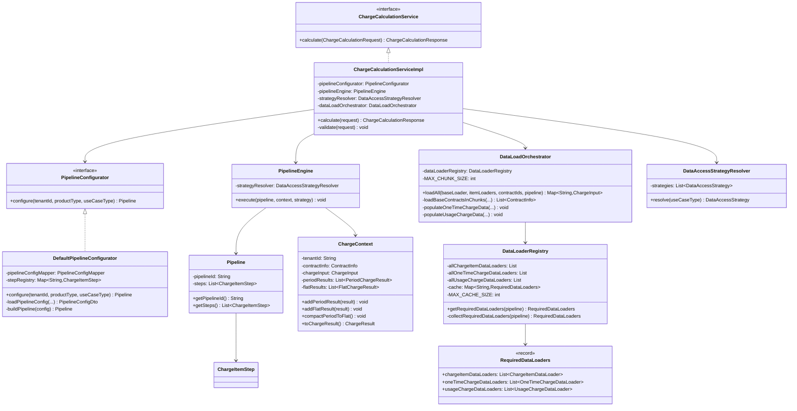

---

## 7. Strategy 패턴 클래스 다이어그램

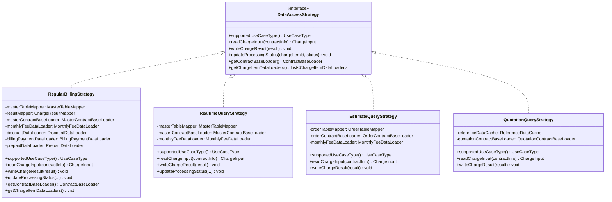

---

## 8. Step 계층 구조

```mermaid
classDiagram
    class ChargeItemStep {
        <<interface>>
        +getStepId() String
        +getOrder() int
        +process(ChargeContext) void
        +requiresStatusUpdate() boolean
        +getRequiredChargeItemTypes() List~ChargeItemType~
        +getRequiredOneTimeChargeDomains() List~Class~
        +getRequiredUsageChargeDomains() List~Class~
    }

    class MonthlyFeeStep {
        -STEP_ID: String
        -ORDER: int
        +getRequiredChargeItemTypes() List~ChargeItemType~
        +process(context) void
        -calculateMonthlyFee(...) void
        -intersectPeriods(...) List~IntersectedPeriod~
    }

    class OneTimeFeeStep {
        -STEP_ID: String
        -ORDER: int
        -oneTimeChargeDataLoaders: List
        +getRequiredOneTimeChargeDomains() List~Class~
        +process(context) void
    }

    class UsageFeeStep {
        -STEP_ID: String
        -ORDER: int
        -usageChargeDataLoaders: List
        +getRequiredUsageChargeDomains() List~Class~
        +process(context) void
    }

    class PeriodDiscountStep {
        -STEP_ID: String
        -ORDER: int
        +getRequiredChargeItemTypes() List~ChargeItemType~
        +process(context) void
        -applyDiscount(...) void
    }

    class PeriodToFlatCompactionStep {
        -STEP_ID: String
        -ORDER: int
        +process(context) void
    }

    class FlatDiscountStep {
        -STEP_ID: String
        -ORDER: int
        +getRequiredChargeItemTypes() List~ChargeItemType~
        +process(context) void
    }

    class LateFeeStep {
        -STEP_ID: String
        -ORDER: int
        +process(context) void
    }

    class AutoPayDiscountStep {
        -STEP_ID: String
        -ORDER: int
        +process(context) void
    }

    class VatStep {
        -STEP_ID: String
        -ORDER: int
        +process(context) void
    }

    class PrepaidOffsetStep {
        -STEP_ID: String
        -ORDER: int
        +getRequiredChargeItemTypes() List~ChargeItemType~
        +process(context) void
    }

    class SplitBillingStep {
        -STEP_ID: String
        -ORDER: int
        +process(context) void
    }

    ChargeItemStep <|.. MonthlyFeeStep
    ChargeItemStep <|.. OneTimeFeeStep
    ChargeItemStep <|.. UsageFeeStep
    ChargeItemStep <|.. PeriodDiscountStep
    ChargeItemStep <|.. PeriodToFlatCompactionStep
    ChargeItemStep <|.. FlatDiscountStep
    ChargeItemStep <|.. LateFeeStep
    ChargeItemStep <|.. AutoPayDiscountStep
    ChargeItemStep <|.. VatStep
    ChargeItemStep <|.. PrepaidOffsetStep
    ChargeItemStep <|.. SplitBillingStep
```

---

## 9. DataLoader 계층 구조

```mermaid
classDiagram
    class ContractBaseLoader {
        <<interface>>
        +loadBaseContracts(contractIds) List~ContractInfo~
    }

    class MasterContractBaseLoader {
        -contractBaseMapper: ContractBaseMapper
        -MAX_CHUNK_SIZE: int
        +loadBaseContracts(contractIds) List~ContractInfo~
    }

    class OrderContractBaseLoader {
        -contractBaseMapper: ContractBaseMapper
        +loadBaseContracts(contractIds) List~ContractInfo~
    }

    class QuotationContractBaseLoader {
        +loadBaseContracts(contractIds) List~ContractInfo~
    }

    class ChargeItemDataLoader {
        <<interface>>
        +getChargeItemType() ChargeItemType
        +loadAndPopulate(contracts, chargeInputMap) void
    }

    class MonthlyFeeDataLoader {
        -monthlyFeeMapper: MonthlyFeeMapper
        +getChargeItemType() ChargeItemType
        +loadAndPopulate(contracts, chargeInputMap) void
    }

    class DiscountDataLoader {
        -discountMapper: DiscountMapper
        +getChargeItemType() ChargeItemType
        +loadAndPopulate(contracts, chargeInputMap) void
    }

    class BillingPaymentDataLoader {
        -billingPaymentMapper: BillingPaymentMapper
        +getChargeItemType() ChargeItemType
        +loadAndPopulate(contracts, chargeInputMap) void
    }

    class PrepaidDataLoader {
        -prepaidMapper: PrepaidMapper
        +getChargeItemType() ChargeItemType
        +loadAndPopulate(contracts, chargeInputMap) void
    }

    class OneTimeChargeDataLoader~T~ {
        <<interface>>
        +getDomainType() Class~T~
        +loadData(contracts) Map~String,List~T~~
    }

    class InstallmentHistoryLoader {
        -installmentHistoryMapper: InstallmentHistoryMapper
        +getDomainType() Class
        +loadData(contracts) Map
    }

    class PenaltyFeeLoader {
        -penaltyFeeMapper: PenaltyFeeMapper
        +getDomainType() Class
        +loadData(contracts) Map
    }

    class UsageChargeDataLoader~T~ {
        <<interface>>
        +getDomainType() Class~T~
        +loadData(contracts) Map~String,List~T~~
    }

    class VoiceUsageLoader {
        -voiceUsageMapper: VoiceUsageMapper
        +getDomainType() Class
        +loadData(contracts) Map
    }

    class DataUsageLoader {
        -dataUsageMapper: DataUsageMapper
        +getDomainType() Class
        +loadData(contracts) Map
    }

    ContractBaseLoader <|.. MasterContractBaseLoader
    ContractBaseLoader <|.. OrderContractBaseLoader
    ContractBaseLoader <|.. QuotationContractBaseLoader

    ChargeItemDataLoader <|.. MonthlyFeeDataLoader
    ChargeItemDataLoader <|.. DiscountDataLoader
    ChargeItemDataLoader <|.. BillingPaymentDataLoader
    ChargeItemDataLoader <|.. PrepaidDataLoader

    OneTimeChargeDataLoader <|.. InstallmentHistoryLoader
    OneTimeChargeDataLoader <|.. PenaltyFeeLoader

    UsageChargeDataLoader <|.. VoiceUsageLoader
    UsageChargeDataLoader <|.. DataUsageLoader
```

---

## 10. Domain Model 구조

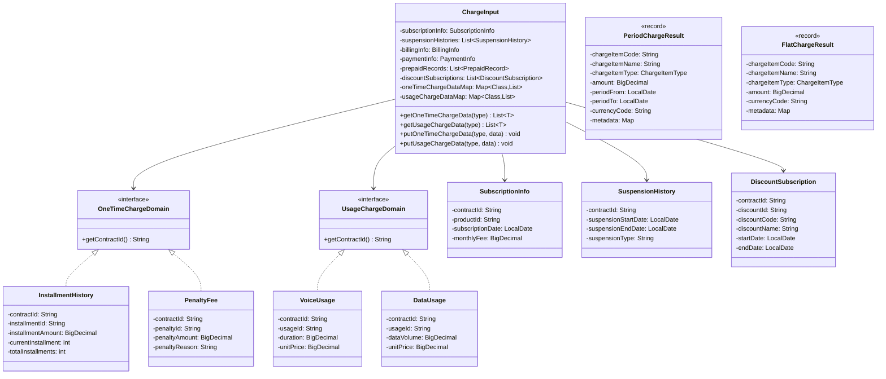

---

## 11. Pipeline 구성 및 실행

```mermaid
graph TB
    subgraph "정기청구 - 무선상품 Pipeline"
        direction LR
        S1[1. MonthlyFeeStep<br/>월정액 계산<br/>기간존재]
        S2[2. OneTimeFeeStep<br/>일회성 요금<br/>기간미존재]
        S3[3. UsageFeeStep<br/>통화료/종량료<br/>기간미존재]
        S4[4. PeriodDiscountStep<br/>할인1<br/>기간존재]
        S5[5. PeriodToFlatCompactionStep<br/>Period→Flat 압축]
        S6[6. FlatDiscountStep<br/>할인2<br/>기간미존재]
        S7[7. LateFeeStep<br/>연체가산금]
        S8[8. AutoPayDiscountStep<br/>자동납부할인]
        S9[9. VatStep<br/>부가세]
        S10[10. PrepaidOffsetStep<br/>선납반제]
        S11[11. SplitBillingStep<br/>분리과금]

        S1 --> S2 --> S3 --> S4 --> S5 --> S6 --> S7 --> S8 --> S9 --> S10 --> S11
    end

    subgraph "견적 조회 - 구독상품 Pipeline (간소화)"
        direction LR
        Q1[1. MonthlyFeeStep<br/>월정액]
        Q2[2. PeriodDiscountStep<br/>할인1]
        Q3[3. PeriodToFlatCompactionStep<br/>압축]
        Q4[4. FlatDiscountStep<br/>할인2]
        Q5[5. VatStep<br/>부가세]

        Q1 --> Q2 --> Q3 --> Q4 --> Q5
    end

    style S1 fill:#e1f5ff
    style S4 fill:#e1f5ff
    style S5 fill:#fff3cd
    style S2 fill:#f8f9fa
    style S3 fill:#f8f9fa
    style S6 fill:#f8f9fa
    style S7 fill:#f8f9fa
    style S8 fill:#f8f9fa
    style S9 fill:#f8f9fa
    style S10 fill:#f8f9fa
    style S11 fill:#f8f9fa
```

---

## 12. 캐시 아키텍처

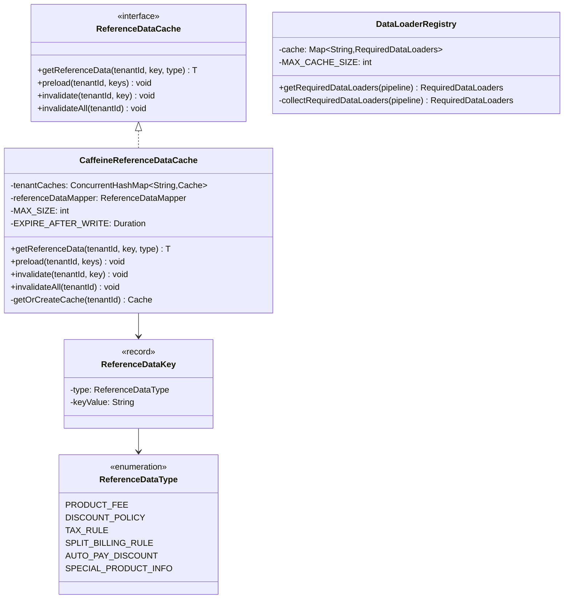

---

## 13. 예외 계층 구조

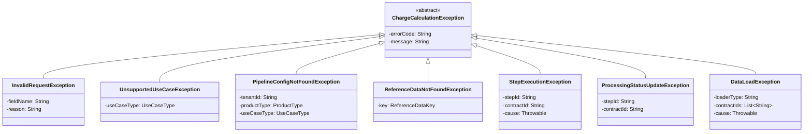

---

## 추가 다이어그램

### Pipeline 구성 데이터베이스 스키마

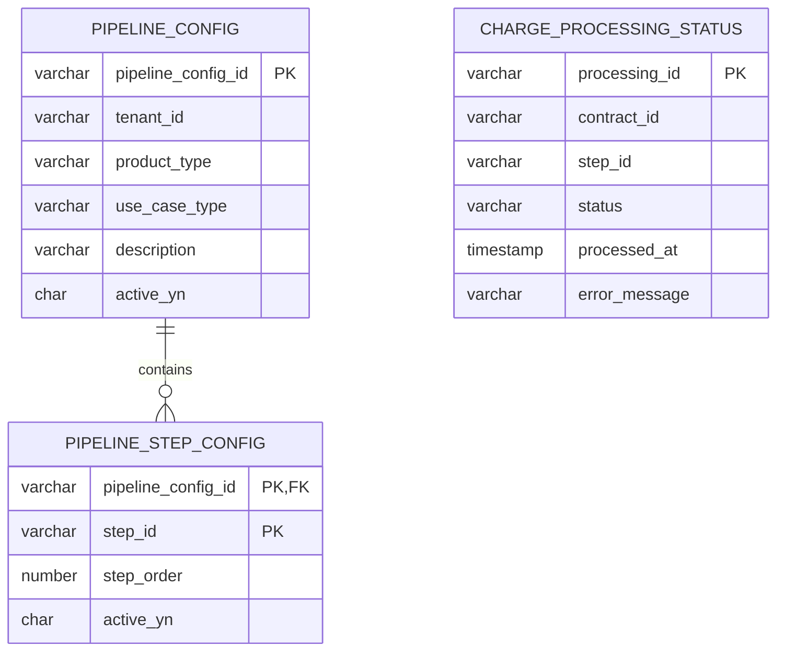

### Chunk 분할 처리 흐름

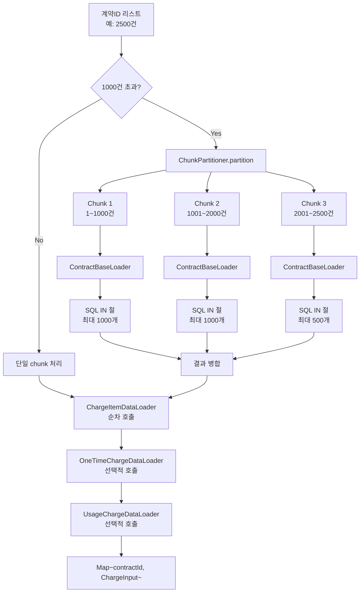

### 선분이력 교차 처리 알고리즘

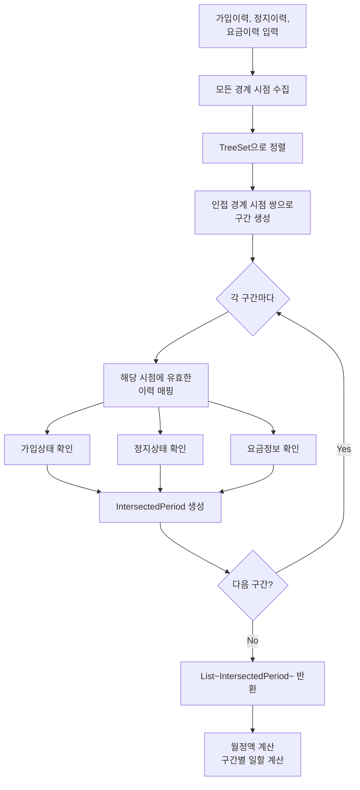

### Period → Flat 압축 알고리즘

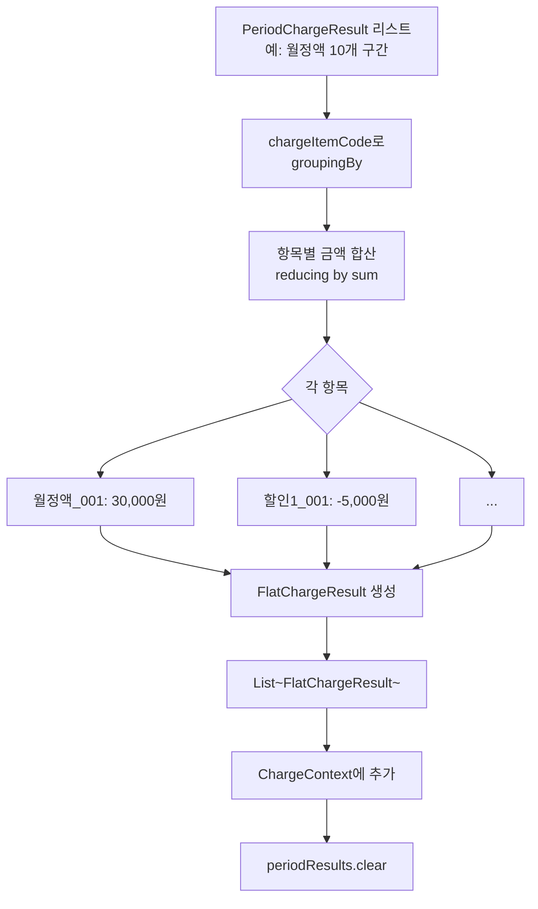

---

## 요약

본 문서는 다음 3개의 설계를 통합한 UML 다이어그램을 제공합니다:

1. **billing-charge-calculation**: Pipeline/Step 기반 요금 계산 프레임워크
2. **subscription-data-load-refactor**: 요금항목별 분리 조회 및 chunk 단위 일괄 로딩
3. **pipeline-based-dataloader-selection**: Pipeline 기반 필요 DataLoader 선택적 호출

### 핵심 패턴
- **Strategy Pattern**: 유스케이스별 데이터 접근 전략 (RegularBilling, Realtime, Estimate, Quotation)
- **Pipeline Pattern**: Step을 순서대로 실행하여 요금 계산 (OCP 준수)
- **3-Jar Architecture**: API/Impl/Internal 분리로 의존성 역전
- **Registry Pattern**: DataLoaderRegistry를 통한 선택적 DataLoader 호출
- **Chunk Pattern**: 최대 1000건 단위 일괄 조회로 DB round trip 최소화

### 성능 최적화
- **Selective DataLoading**: Pipeline에 포함된 Step의 DataLoader만 호출 (최대 75% DB 조회 감소)
- **LRU Cache**: Pipeline별 필요 DataLoader 목록 캐싱
- **Reference Data Cache**: Caffeine 기반 테넌트별 분리 캐시
- **Chunk Partitioning**: Oracle IN 절 제한(1000개) 준수

### 확장성
- 새로운 요금항목 추가 시 ChargeItemStep 구현체만 추가
- 새로운 일회성/사용량 요금 추가 시 DataLoader 구현체만 추가
- 기존 코드 변경 없이 새로운 유스케이스 추가 가능 (OCP)
